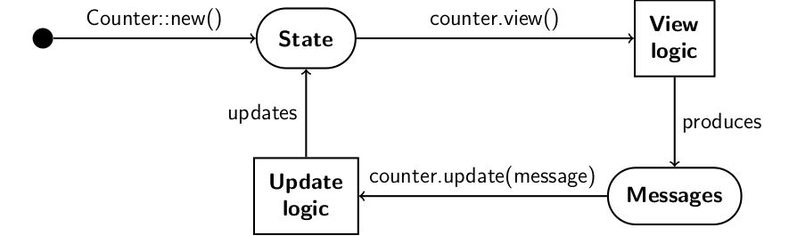
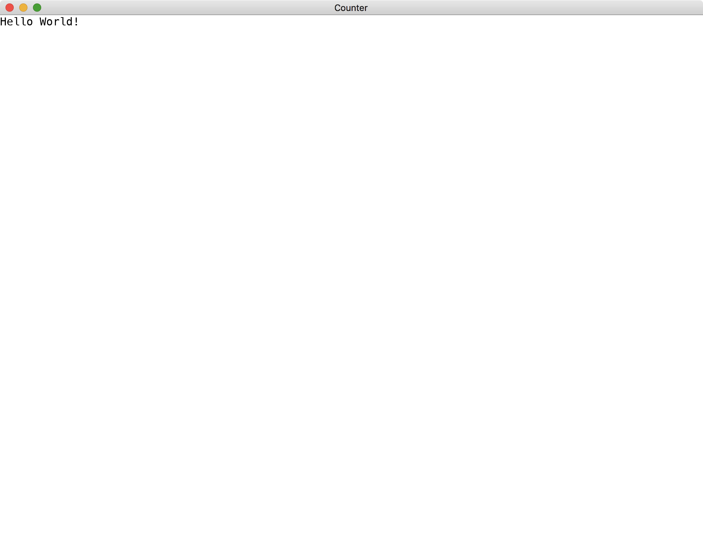
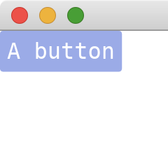
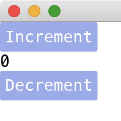
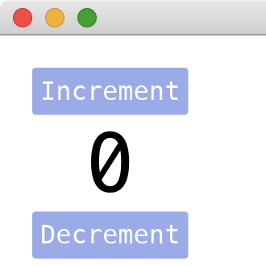

# Tutorial of Iced library

[**Iced**](https://iced.rs/) is a cross-platform GUI library for [Rust](https://www.rust-lang.org/).
This tutorial explains how to write a simple window app with **Iced**.
More precisely, it explains the code of [Counter](https://github.com/iced-rs/iced/tree/master/examples/counter) step by step.

Contents:

1. [Initializing a project](#initializing-a-project)
1. [A simple template](#a-simple-template)
1. [How the methods are called](#how-the-methods-are-called)
1. [A runnable app](#a-runnable-app)
1. [Adding other widgets](#adding-other-widgets)
1. [Producing and receiving messages](#producing-and-receiving-messages)
1. [Updating state and view](#updating-state-and-view)
1. [See also](#see-also)

## Initializing a project

Let's create a new [Cargo](https://doc.rust-lang.org/cargo/guide/) project.

```sh
cargo new simple_counter
```

Add **Iced** as a dependency to `Cargo.toml`.

```toml
iced = "0.10"
```

*Note:*
Currently **Iced** and its dependencies are still under development.
Sometimes it outputs errors such as `wgpu: Validation Error`.
You can disable `wgpu` in `Cargo.toml` like this.

```toml
iced = { version = "0.10", default-features = false }
```

## A simple template

In `src/main.rs` in the Cargo project, create a struct `Counter` and implement [Sandbox](https://docs.iced.rs/iced/trait.Sandbox.html) trait as suggested by the **Iced** [API Reference](https://docs.iced.rs/iced/).

If you are using editors such as [Visual Studio Code](https://code.visualstudio.com/), you can select `Quick Fix` and `Implement missing members`.
This should produce the following code.

```rust
use iced::Sandbox;

struct Counter;

impl Sandbox for Counter {
    type Message;

    fn new() -> Self {
        todo!()
    }

    fn title(&self) -> String {
        todo!()
    }

    fn update(&mut self, message: Self::Message) {
        todo!()
    }

    fn view(&self) -> iced::Element<'_, Self::Message> {
        todo!()
    }
}
```

## How the methods are called

There are four methods in the template that must be implemented.
The `String` returned by `title` will be the title of the created window.
The other three members are described in the following diagram.



Initially, the **Iced** framework calls `Counter::new()` to create a `Counter` struct, which is responsible for maintaining its state.
Whenever the state is changed, **Iced** calls the `view` method, in which we describe what the widgets we have, how to show them and when the widgets produce messages.
After a message is produced, it is passed to the `update` method, where we describe how to update the state based on the message received.
This loop keeps running until the window is closed.

## A runnable app

To have a minimal runnable app, we make the following changes:

* Return an empty `Counter` in `new`.
* Return a `String` in `title`.
* Remove the code inside `update`.
* Add a [Text](https://docs.iced.rs/iced/widget/type.Text.html) widget in `view` and return it.
* Specify the unit value to the `Message` associated type.
* Call `Counter::run` with the default [Settings](https://docs.iced.rs/iced/settings/struct.Settings.html) in `main`.
* Bring the corresponding structs into the scope.

At the moment, the code should be similar to the following.

```rust
use iced::{widget::Text, Sandbox, Settings};

fn main() -> iced::Result {
    Counter::run(Settings::default())
}

struct Counter;

impl Sandbox for Counter {
    type Message = ();

    fn new() -> Self {
        Self
    }

    fn title(&self) -> String {
        String::from("Counter")
    }

    fn update(&mut self, _message: Self::Message) {}

    fn view(&self) -> iced::Element<'_, Self::Message> {
        Text::new("Hello World!").into()
    }
}
```

We make `main` to also return [iced::Result](https://docs.iced.rs/iced/type.Result.html), which is a type alias of `Result<(), iced::Error>` and is returned by `Counter::run`.

Inside the `view` method, we use `into` to turn `Text` to `iced::Element`, which is a generic struct accepting all widgets.
In fact, any widgets in **Iced** has the `into` method that can turn the widget to `iced::Element`.

Run the program.
We should see a window displaying the specified text.

```sh
cargo run
```



## Adding other widgets

Now let's replace the `Text` widget with a [Button](https://docs.iced.rs/iced/widget/struct.Button.html) widget.
The `Button` widget needs a widget in its `new` function.
We can just construct a `Text` widget for it.

```rust
use iced::{
    widget::{Button, Text},
    Sandbox, Settings,
};

// --snip--

impl Sandbox for Counter {

    // --snip--

    fn view(&self) -> iced::Element<'_, Self::Message> {
        Button::new(Text::new("A button")).into()
    }
}
```

Note that the `into` method is called as the last method in `view` to wrap all the widgets up.

This code gives the result.



The `new` function of `Button` takes an `Into` trait as a parameter, which takes any structs that can be converted into [iced_core::Element](https://docs.iced.rs/iced_core/struct.Element.html).
This gives us a syntax sugar to simplify `Text::new` to `&str`, as `iced_core::Element` has implemented `From<&'a str>`.

```rust
    fn view(&self) -> iced::Element<'_, Self::Message> {
        Button::new("A button").into()
    }
```

Moreover, **Iced** provides other syntax sugar functions and marcros, such as [text](https://docs.iced.rs/iced/widget/fn.text.html) for [Text](https://docs.iced.rs/iced/widget/type.Text.html) and [button](https://docs.iced.rs/iced/widget/fn.button.html) for [Button](https://docs.iced.rs/iced/widget/struct.Button.html).

```rust
    fn view(&self) -> iced::Element<'_, Self::Message> {
        button("A button").into()
    }
```

To add multiple widgets, we can use [column](https://docs.iced.rs/iced/widget/macro.column.html) macro to arrange a group of widgets vertically in the window.
The syntax `column![A, B, C]` can be treated as `Column::new().push(A).push(B).push(C)`, although the underlying implementation is slightly different.

```rust
use iced::{
    widget::{button, column, text},
    Sandbox, Settings,
};

// --snip--

impl Sandbox for Counter {

    // --snip--

    fn view(&self) -> iced::Element<'_, Self::Message> {
        column![button("Increment"), text("0"), button("Decrement")].into()
    }
}
```



Most widgets have methods for setting their styles.
For example, `size` of `Text` sets the font size of the widget and `align_items` of `Column` sets the horizontal alignment of its content widgets.

```rust
use iced::{
    widget::{button, column, text},
    Alignment, Sandbox, Settings,
};

// --snip--

impl Sandbox for Counter {

    // --snip--

    fn view(&self) -> iced::Element<'_, Self::Message> {
        column![button("Increment"), text("0").size(50), button("Decrement")]
            .padding(20)
            .align_items(Alignment::Center)
            .into()
    }
}
```



## Producing and receiving messages

To enable the buttons, we need to call the `on_press` method of `Button`.
This method takes a parameter of a message defined by ourselves.
The message is an enum type and needs to be specified in the associated type of `Sandbox`.

```rust
#[derive(Debug, Copy, Clone)]
enum CounterMessage {
    IncrementPressed,
    DecrementPressed,
}

impl Sandbox for Counter {
    type Message = CounterMessage;
    
    // --snip--

    fn view(&self) -> iced::Element<'_, Self::Message> {
        column![
            button("Increment").on_press(CounterMessage::IncrementPressed),
            text("0").size(50),
            button("Decrement").on_press(CounterMessage::DecrementPressed)
        ]
        // --snip--
    }
}
```

Note that `CounterMessage` needs to derive at least `Debug` and `Clone` traits, otherwise the compiler would give errors/warnings.
Additionally, it is a good practice to make the struct also derive the `Copy` trait.

When we press a button with its `on_press` method being set to a message, the message is sent to the underlying **Iced** framework.
The framework will redirect the message to the `update` method of our app, where we describe how to handle the message.
Here, we just print the messages we received.

```rust
impl Sandbox for Counter {
    
    // --snip--

    fn update(&mut self, message: Self::Message) {
        match message {
            CounterMessage::IncrementPressed => println!("IncrementPressed"),
            CounterMessage::DecrementPressed => println!("DecrementPressed"),
        }
    }
}
```

## Updating state and view

Instead of printing the messages, we usually update the internal state of our app when the messages are received.
In the simple counter app, the internal state is the `value` field in `Counter` struct.

```rust
struct Counter {
    value: i32,
}

// --snip--

impl Sandbox for Counter {
    fn new() -> Self {
        Self { value: 0 }
    }
    // --snip--
}
```

The `value` field is adjusted when we receive a message in `update`.

```rust
    fn update(&mut self, message: Self::Message) {
        match message {
            CounterMessage::IncrementPressed => self.value += 1,
            CounterMessage::DecrementPressed => self.value -= 1,
        }
    }
```

Then we show the `value` field with the `Text` widget in `view`.

```rust
    fn view(&self) -> iced::Element<'_, Self::Message> {
        column![
            button("Increment").on_press(CounterMessage::IncrementPressed),
            text(self.value).size(50),
            button("Decrement").on_press(CounterMessage::DecrementPressed)
        ]
        // --snip--
    }
```

Run the program and we can see that the number inside the `Text` widget is changed by pressing the buttons.

The full code can be found in the [Counter](https://github.com/iced-rs/iced/tree/master/examples/counter) example.

## See also

* [**Iced**](https://github.com/iced-rs/iced) - the **Iced** library.
* [awesome-iced](https://github.com/iced-rs/awesome-iced) - a list of projects depending on **Iced**.

## Contributing

Contributions are welcome!
