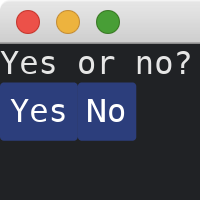

# Adding Widgets

Use [column!](https://docs.rs/iced/0.12.1/iced/widget/macro.column.html) and [row!](https://docs.rs/iced/0.12.1/iced/widget/macro.row.html) to group multiple widgets such as [text](https://docs.rs/iced/0.12.1/iced/widget/fn.text.html) and [button](https://docs.rs/iced/0.12.1/iced/widget/fn.button.html).

```rust
use iced::{
    widget::{button, column, row, text},
    Sandbox, Settings,
};

fn main() -> iced::Result {
    MyApp::run(Settings::default())
}

struct MyApp;

impl Sandbox for MyApp {
    type Message = ();

    fn new() -> Self {
        Self
    }

    fn title(&self) -> String {
        String::from("My App")
    }

    fn update(&mut self, _message: Self::Message) {}

    fn view(&self) -> iced::Element<'_, Self::Message> {
        column![
            text("Yes or no?"),
            row![
                button("Yes"),
                button("No"),
            ],
        ].into()
    }
}
```



:arrow_right:  Next: [Changing Displaying Content](./changing_displaying_content.md)

:blue_book: Back: [Table of contents](./../README.md)
