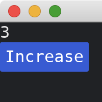

# Application Lifecycle

A standard Iced application lifecycle is very similar to how [Elm](https://elm-lang.org/) does it.

Here's a break down:

- The `view` renders widgets with the current state
- The user interacts with these widgets (e.g. a button)
- The button dispatches a message
- The message is processed by `update` and mutates the state
- Repeat...

In practical terms, considering our application below:

- The `view` is rendering a [text](https://docs.rs/iced/0.13.1/iced/widget/text/index.html) and a [button](https://docs.rs/iced/0.13.1/iced/widget/button/index.html) in a [column](https://docs.rs/iced/0.13.1/iced/widget/macro.column.html) layout
- The user clicks the button, which listens for an event (`on_press`)
- The buttons dispatches the message (`Message::ButtonPressed`)
- The message is matched on the `update` function, and the counter is incremented by 1
- Repeat...

```rust
use iced::widget::{button, column, text};

fn main() -> iced::Result {
    iced::run("My App", MyApp::update, MyApp::view)
}

#[derive(Debug, Clone)]
enum Message {
    ButtonPressed,
}

#[derive(Default)]
struct MyApp {
    counter: usize,
}

impl MyApp {
    fn update(&mut self, message: Message) {
        match message {
            Message::ButtonPressed => self.counter += 1,
        }
    }

    fn view(&self) -> iced::Element<Message> {
        column![
            text(self.counter),
            button("Increase").on_press(Message::ButtonPressed),
        ]
        .into()
    }
}
```



:arrow_right: Next: [Adding Widgets](./adding_widgets.md)

:blue_book: Back: [Table of contents](./../README.md)
