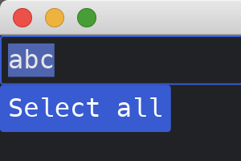

# Batch Commands

Sometimes, we want to execute two or more `Commands` at the same time.
In this case, we can use `Command::batch` function.

```rust
use iced::{
    executor,
    widget::{button, column, text_input},
    Application, Command, Settings,
};

fn main() -> iced::Result {
    MyApp::run(Settings::default())
}

const MY_TEXT_ID: &str = "my_text";

#[derive(Debug, Clone)]
enum MyAppMessage {
    UpdateText(String),
    SelectAll,
}

struct MyApp {
    some_text: String,
}

impl Application for MyApp {
    type Executor = executor::Default;
    type Message = MyAppMessage;
    type Theme = iced::Theme;
    type Flags = ();

    fn new(_flags: Self::Flags) -> (Self, iced::Command<Self::Message>) {
        (
            Self {
                some_text: String::new(),
            },
            Command::none(),
        )
    }

    fn title(&self) -> String {
        String::from("My App")
    }

    fn update(&mut self, message: Self::Message) -> iced::Command<Self::Message> {
        match message {
            MyAppMessage::UpdateText(s) => self.some_text = s,
            MyAppMessage::SelectAll => {
                return Command::batch(vec![
                    text_input::focus(text_input::Id::new(MY_TEXT_ID)),
                    text_input::select_all(text_input::Id::new(MY_TEXT_ID)),
                ])
            }
        }
        Command::none()
    }

    fn view(&self) -> iced::Element<'_, Self::Message, iced::Renderer<Self::Theme>> {
        column![
            text_input("", &self.some_text)
                .id(text_input::Id::new(MY_TEXT_ID))
                .on_input(MyAppMessage::UpdateText),
            button("Select all").on_press(MyAppMessage::SelectAll),
        ]
        .into()
    }
}
```



:arrow_right:  Next: [Executing Custom Commands](./executing_custom_commands.md)

:blue_book: Back: [Table of contents](./../README.md)
