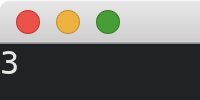

# Batch Subscriptions

This tutorial follows from the previous two tutorials ([keyboard events](./producing_messages_by_keyboard_events.md) and [timers](./producing_messages_by_timers.md)).
We combine the two [Subscriptions](https://docs.rs/iced/0.13.1/iced/struct.Subscription.html) of keyboard events and timers.
This is done by [Subscription::batch](https://docs.rs/iced/0.13.1/iced/struct.Subscription.html#method.batch) function.

In the following app, press the space key to start or stop the timer.

```rust
use iced::{
    Event, Subscription, Task,
    event::{self, Status},
    keyboard::{Key, key::Named},
    time::{self, Duration},
    widget::text,
};

fn main() -> iced::Result {
    iced::application("My App", MyApp::update, MyApp::view)
        .subscription(MyApp::subscription)
        .run_with(MyApp::new)
}

#[derive(Debug, Clone)]
enum Message {
    StartOrStop,
    Update,
}

#[derive(Default)]
struct MyApp {
    seconds: u32,
    running: bool,
}

impl MyApp {
    fn new() -> (Self, Task<Message>) {
        (
            Self {
                seconds: 0,
                running: false,
            },
            Task::none(),
        )
    }

    fn update(&mut self, message: Message) -> Task<Message> {
        match message {
            Message::StartOrStop => self.running = !self.running,
            Message::Update => self.seconds += 1,
        }
        Task::none()
    }

    fn view(&self) -> iced::Element<Message> {
        text(self.seconds).into()
    }

    fn subscription(&self) -> Subscription<Message> {
        let subscr_key = event::listen_with(|event, status, _| match (event, status) {
            (
                Event::Keyboard(iced::keyboard::Event::KeyPressed {
                    key: Key::Named(Named::Space),
                    ..
                }),
                Status::Ignored,
            ) => Some(Message::StartOrStop),
            _ => None,
        });

        if self.running {
            Subscription::batch(vec![
                subscr_key,
                time::every(Duration::from_secs(1)).map(|_| Message::Update),
            ])
        } else {
            subscr_key
        }
    }
}
```



:arrow_right:  Next: [Canvas](./canvas.md)

:blue_book: Back: [Table of contents](./../README.md)
