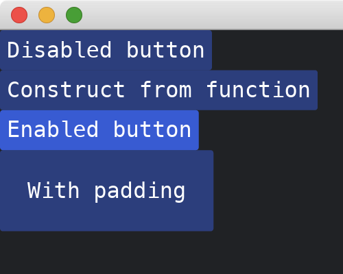

# Button

The [Button](https://docs.iced.rs/iced/widget/button/struct.Button.html) widget supports reactions to pressing/touching events.
It has two methods of constructions.
If the method [on_press](https://docs.iced.rs/iced/widget/button/struct.Button.html#method.on_press) is set, the button is enabled, and is disabled otherwise.
We can also set padding around the text of the button.

```rust
use iced::{
    widget::{button, column, Button},
    Sandbox, Settings,
};

fn main() -> iced::Result {
    MyApp::run(Settings::default())
}

#[derive(Debug, Clone)]
enum MyAppMessage {
    DoSomething,
}

struct MyApp;

impl Sandbox for MyApp {
    type Message = MyAppMessage;

    fn new() -> Self {
        Self
    }

    fn title(&self) -> String {
        String::from("My App")
    }

    fn update(&mut self, _message: Self::Message) {}

    fn view(&self) -> iced::Element<'_, Self::Message> {
        column![
            Button::new("Disabled button"),
            button("Construct from function"),
            button("Enabled button").on_press(MyAppMessage::DoSomething),
            button("With padding").padding(20),
        ]
        .into()
    }
}
```



:arrow_right:  Next: [TextInput](./text_input.md)
