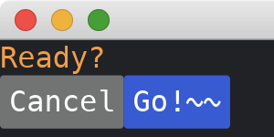

# Changing Styles

Most widgets support `style` method to change their styles.
These methods take parameters from [enums](https://doc.rust-lang.org/std/keyword.enum.html) of [theme](https://docs.iced.rs/iced/theme/index.html) module.
For example, [widget::Text](https://docs.iced.rs/iced/widget/type.Text.html) takes [theme::Text](https://docs.iced.rs/iced/theme/enum.Text.html) as the parameter of its [style](https://docs.iced.rs/iced/advanced/widget/struct.Text.html#method.style) method, and [widget::Button](https://docs.iced.rs/iced/widget/struct.Button.html) takes [theme::Button](https://docs.iced.rs/iced/theme/enum.Button.html) as the parameter of its [style](https://docs.iced.rs/iced/widget/struct.Button.html#method.style) method.

Since [theme::Text](https://docs.iced.rs/iced/theme/enum.Text.html) implements [From\<Color>](https://docs.iced.rs/iced/theme/enum.Text.html#impl-From%3CColor%3E-for-Text), we can also use [Color](https://docs.iced.rs/iced/struct.Color.html) struct directly for the [style](https://docs.iced.rs/iced/advanced/widget/struct.Text.html#method.style) method of [widget::Text](https://docs.iced.rs/iced/widget/type.Text.html).

```rust
use iced::{
    theme,
    widget::{button, column, row, text},
    Sandbox, Settings, Color,
};

fn main() -> iced::Result {
    MyApp::run(Settings::default())
}

#[derive(Debug, Clone)]
enum MyAppMessage {
    DummyMessage,
}

struct MyApp;

impl Sandbox for MyApp {
    type Message = MyAppMessage;

    fn new() -> Self {
        Self
    }

    fn title(&self) -> String {
        String::from("My App")
    }

    fn update(&mut self, _message: Self::Message) {}

    fn view(&self) -> iced::Element<'_, Self::Message> {
        column![
            text("Ready?").style(Color::from_rgb(1., 0.6, 0.2)),
            row![
                button("Cancel")
                    .style(theme::Button::Secondary)
                    .on_press(MyAppMessage::DummyMessage),
                button("Go!~~")
                    .style(theme::Button::Primary)
                    .on_press(MyAppMessage::DummyMessage),
            ],
        ]
        .into()
    }
}
```



:arrow_right:  Next: [Custom Styles](./custom_styles.md)
