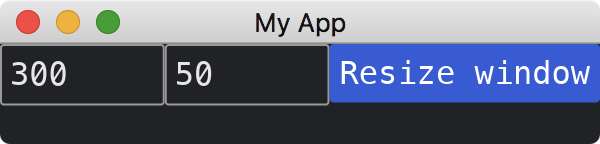

# Changing The Window Dynamically

We can use functions provided in [window](https://docs.rs/iced/0.12.1/iced/window/index.html) module to change the window after it is initialized.
For example, to [resize](https://docs.rs/iced/0.12.1/iced/window/fn.resize.html) the window.
These functions return [Command](https://docs.rs/iced/0.12.1/iced/struct.Command.html), which can be used as the return value in [update](https://docs.rs/iced/0.12.1/iced/application/trait.Application.html#tymethod.update) method.
Developers might be interested in other [Commands](https://docs.rs/iced/0.12.1/iced/struct.Command.html) in [window](https://docs.rs/iced/0.12.1/iced/window/index.html) module.

Note: If you find [resize](https://docs.rs/iced/0.12.1/iced/window/fn.resize.html) needs an [Id](https://docs.rs/iced/0.12.1/iced/window/struct.Id.html), you can get it by [fetch_id](https://docs.rs/iced/0.12.1/iced/window/fn.fetch_id.html).

```rust
use iced::{
    executor,
    widget::{button, row, text_input},
    window, Application, Command, Settings, Size,
};

fn main() -> iced::Result {
    MyApp::run(Settings::default())
}

#[derive(Debug, Clone)]
enum MyAppMessage {
    UpdateWidth(String),
    UpdateHeight(String),
    ResizeWindow,
}

struct MyApp {
    width: String,
    height: String,
}

impl Application for MyApp {
    type Executor = executor::Default;
    type Message = MyAppMessage;
    type Theme = iced::Theme;
    type Flags = ();

    fn new(_flags: Self::Flags) -> (Self, iced::Command<Self::Message>) {
        (
            Self {
                width: "1024".into(),
                height: "768".into(),
            },
            Command::none(),
        )
    }

    fn title(&self) -> String {
        String::from("My App")
    }

    fn update(&mut self, message: Self::Message) -> iced::Command<Self::Message> {
        match message {
            MyAppMessage::UpdateWidth(w) => self.width = w,
            MyAppMessage::UpdateHeight(h) => self.height = h,
            MyAppMessage::ResizeWindow => {
                return window::resize(Size::new(
                    self.width.parse().unwrap(),
                    self.height.parse().unwrap(),
                ))
            }
        }
        Command::none()
    }

    fn view(&self) -> iced::Element<'_, Self::Message> {
        row![
            text_input("Width", &self.width).on_input(MyAppMessage::UpdateWidth),
            text_input("Height", &self.height).on_input(MyAppMessage::UpdateHeight),
            button("Resize window").on_press(MyAppMessage::ResizeWindow),
        ]
        .into()
    }
}
```



:arrow_right:  Next: [Closing The Window On Demand](./closing_the_window_on_demand.md)

:blue_book: Back: [Table of contents](./../README.md)
