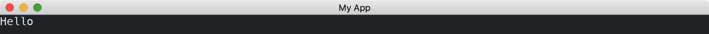

# Changing Themes

We can implement [theme](https://docs.iced.rs/iced/trait.Sandbox.html#method.theme) method in [Sandbox](https://docs.iced.rs/iced/trait.Sandbox.html) to return the desired theme.

```rust
use iced::{Sandbox, Settings};

fn main() -> iced::Result {
    MyApp::run(Settings::default())
}

struct MyApp;

impl Sandbox for MyApp {
    type Message = ();

    fn new() -> Self {
        Self
    }

    fn title(&self) -> String {
        String::from("My App")
    }

    fn update(&mut self, _message: Self::Message) {}

    fn view(&self) -> iced::Element<'_, Self::Message> {
        "Hello".into()
    }

    fn theme(&self) -> iced::Theme {
        iced::Theme::Dark
        // or
        // iced::Theme::Light
    }
}
```



:arrow_right:  Next: [Changing Styles](./changing_styles.md)

:blue_book: Back: [Table of contents](./../README.md)
