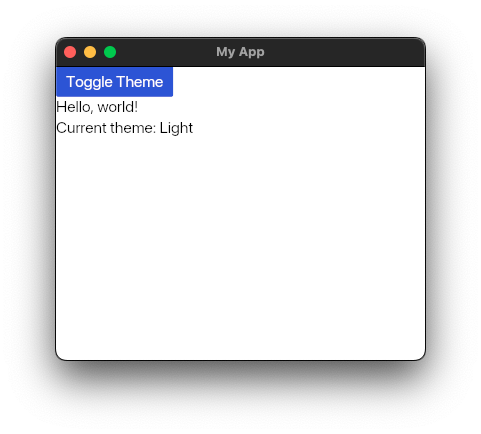
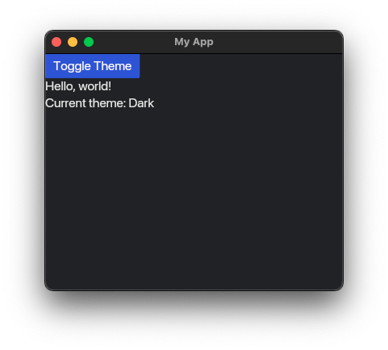

# Changing Themes

To change the theme of the application, we can implement the [`theme`](https://docs.rs/iced/0.13.1/iced/application/trait.Application.html#method.theme) method in the application. Changing the theme can be done at runtime.

```rust
use iced::widget::{button, column, text};

fn main() -> iced::Result {
    iced::application("My App", MyApp::update, MyApp::view)
        .theme(MyApp::theme)
        .run()
}

#[derive(Debug, Clone)]
enum Message {
    ToggleTheme,
}

#[derive(Default)]
struct MyApp {
    theme: iced::Theme,
}

impl MyApp {
    fn update(&mut self, _message: Message) {
        match _message {
            Message::ToggleTheme => {
                self.theme = match self.theme {
                    iced::Theme::Dark => iced::Theme::Light,
                    iced::Theme::Light => iced::Theme::Dark,
                    _ => iced::Theme::Dark,
                };
            }
        }
    }

    fn view(&self) -> iced::Element<Message> {
        column![
            button("Toggle Theme").on_press(Message::ToggleTheme),
            text("Hello, world!"),
            text(format!("Current theme: {}", self.theme)),
        ]
        .into()
    }

    fn theme(&self) -> iced::Theme {
        self.theme.clone()
    }
}
```




:arrow_right: Next: [Changing Styles](./changing_styles.md)

:blue_book: Back: [Table of contents](./../README.md)
