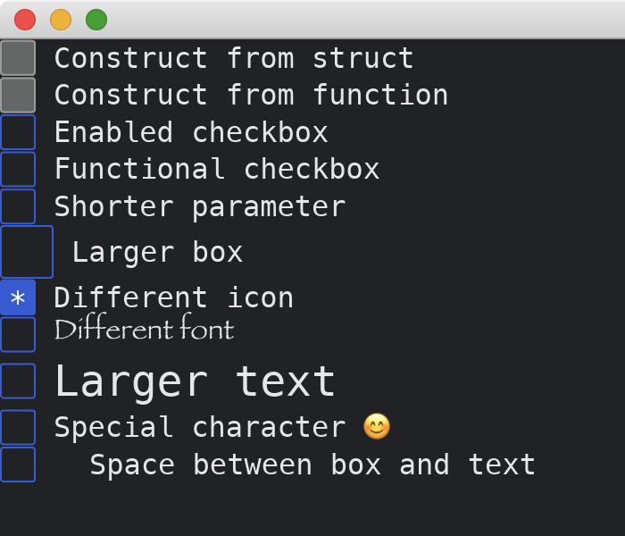

# Checkbox

The [Checkbox](https://docs.iced.rs/iced/widget/checkbox/struct.Checkbox.html) widget represents a boolean value.
It has two methods of constructions.
It supports reactions to clicking and touching.
It is able to change styles of the box and the text.
It can also change the space between them.

```rust
use iced::{
    widget::{checkbox, checkbox::Icon, column, Checkbox, text::{LineHeight, Shaping}},
    Sandbox, Settings, Font, font::Family,
};

fn main() -> iced::Result {
    MyApp::run(Settings::default())
}

#[derive(Debug, Clone)]
enum MyAppMessage {
    DoNothing,
    Update3(bool),
    Update4(bool),
}

#[derive(Default)]
struct MyApp {
    checkbox3: bool,
    checkbox4: bool,
}

impl Sandbox for MyApp {
    type Message = MyAppMessage;

    fn new() -> Self {
        Self {
            ..Default::default()
        }
    }

    fn title(&self) -> String {
        String::from("My App")
    }

    fn update(&mut self, message: Self::Message) {
        match message {
            MyAppMessage::DoNothing => {}
            MyAppMessage::Update3(b) => self.checkbox3 = b,
            MyAppMessage::Update4(b) => self.checkbox4 = b,
        }
    }

    fn view(&self) -> iced::Element<'_, Self::Message> {
        column![
            Checkbox::new("Construct from struct", false, |_| MyAppMessage::DoNothing),
            checkbox("Construct from function", false, |_| {
                MyAppMessage::DoNothing
            }),
            checkbox("Functional checkbox", self.checkbox3, |b| MyAppMessage::Update3(b)),
            checkbox("Shorter parameter", self.checkbox4, MyAppMessage::Update4),
            checkbox("Larger box", false, |_| MyAppMessage::DoNothing).size(30),
            checkbox("Different icon", true, |_| MyAppMessage::DoNothing).icon(Icon {
                font: Font::DEFAULT,
                code_point: '*',
                size: None,
                line_height: LineHeight::default(),
                shaping: Shaping::default()
            }),
            checkbox("Different font", false, |_| MyAppMessage::DoNothing).font(Font {
                family: Family::Fantasy,
                ..Font::DEFAULT
            }),
            checkbox("Larger text", false, |_| MyAppMessage::DoNothing).text_size(24),
            checkbox("Special character 😊", false, |_| MyAppMessage::DoNothing).text_shaping(Shaping::Advanced),
            checkbox("Space between box and text", false, |_| MyAppMessage::DoNothing).spacing(30),
        ]
        .into()
    }
}
```



:arrow_right:  Next: [Toggler](./toggler.md)

:blue_book: Back: [Table of contents](./../README.md)
