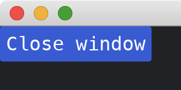

# Closing The Window On Demand

This tutorial follows the [previous tutorial](./changing_the_window_dynamically.md).
We use the [close](https://docs.rs/iced/0.12.1/iced/window/fn.close.html) function in [window](https://docs.rs/iced/0.12.1/iced/window/index.html) module to close the window.
This is also done by returning the [Command](https://docs.rs/iced/0.12.1/iced/struct.Command.html) obtained by [close](https://docs.rs/iced/0.12.1/iced/window/fn.close.html) function.

Note: If you find the function needs an [Id](https://docs.rs/iced/0.12.1/iced/window/struct.Id.html), you can get it by [fetch_id](https://docs.rs/iced/0.12.1/iced/window/fn.fetch_id.html).

```rust
use iced::{
    executor,
    widget::{button, row},
    window, Application, Command, Settings,
};

fn main() -> iced::Result {
    MyApp::run(Settings::default())
}

#[derive(Debug, Clone)]
enum MyAppMessage {
    CloseWindow,
}

struct MyApp;

impl Application for MyApp {
    type Executor = executor::Default;
    type Message = MyAppMessage;
    type Theme = iced::Theme;
    type Flags = ();

    fn new(_flags: Self::Flags) -> (Self, iced::Command<Self::Message>) {
        (Self, Command::none())
    }

    fn title(&self) -> String {
        String::from("My App")
    }

    fn update(&mut self, message: Self::Message) -> iced::Command<Self::Message> {
        match message {
            MyAppMessage::CloseWindow => window::close(),
			// MyAppMessage::CloseWindow => window::close(window::Id::MAIN),
        }
    }

    fn view(&self) -> iced::Element<'_, Self::Message, iced::Renderer<Self::Theme>> {
        row![button("Close window").on_press(MyAppMessage::CloseWindow),].into()
    }
}
```



:arrow_right:  Next: [On Pressed/Released Of Some Widgets](./on_pressed_released_of_some_widgets.md)

:blue_book: Back: [Table of contents](./../README.md)
