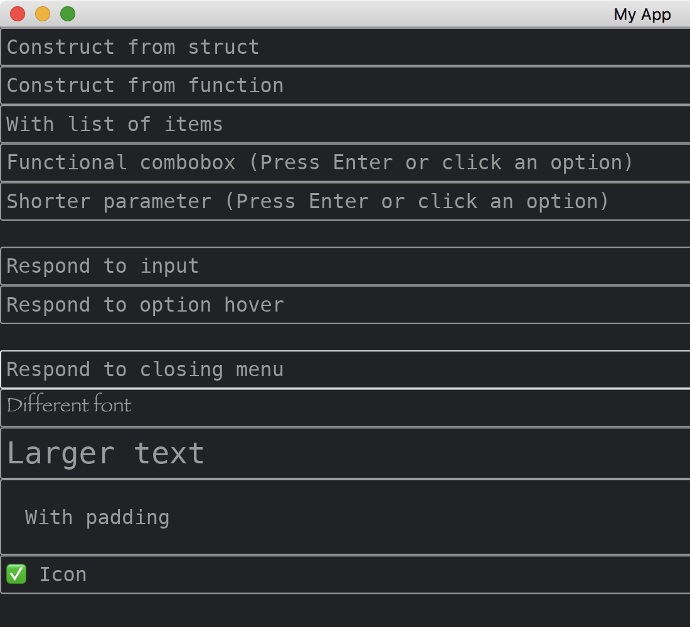

# ComboBox

The [ComboBox](https://docs.iced.rs/iced/widget/combo_box/struct.ComboBox.html) widget represents a choice among multiple values.
The values are shown in a dropdown menu and is searchable.
The widget has two methods of constructions.
It supports reactions to keyboard inputs and mouse selections.
It is able to change fonts.
We can add padding around the text inside.
We can also add an optional icon.

```rust
use iced::{
    font::Family,
    widget::{
        column, combo_box,
        combo_box::State,
        text,
        text_input::{Icon, Side},
        ComboBox,
    },
    Font, Sandbox, Settings,
};

fn main() -> iced::Result {
    MyApp::run(Settings::default())
}

#[derive(Debug, Clone)]
enum MyAppMessage {
    DoNothing,
    Select4(String),
    Select5(String),
    Select6(String),
    Input6(String),
    Select7(String),
    Hover7(String),
    Select8(String),
    Hover8(String),
    Close8,
}

struct MyApp {
    state1: State<u32>,
    state2: State<u32>,
    state3: State<String>,
    state4: State<String>,
    select4: Option<String>,
    state5: State<String>,
    select5: Option<String>,
    state6: State<String>,
    select6: Option<String>,
    input6: String,
    state7: State<String>,
    select7: Option<String>,
    state8: State<String>,
    select8: Option<String>,
    info8: String,
    state9: State<u32>,
    state10: State<u32>,
    state11: State<u32>,
}

impl Sandbox for MyApp {
    type Message = MyAppMessage;

    fn new() -> Self {
        Self {
            state1: State::new(vec![]),
            state2: State::new(vec![]),
            state3: State::new(["Aa", "Ab", "Ba", "Bb"].map(|s| s.to_string()).to_vec()),
            state4: State::new(["Aa", "Ab", "Ba", "Bb"].map(|s| s.to_string()).to_vec()),
            select4: None,
            state5: State::new(["Aa", "Ab", "Ba", "Bb"].map(|s| s.to_string()).to_vec()),
            select5: None,
            state6: State::new(["Aa", "Ab", "Ba", "Bb"].map(|s| s.to_string()).to_vec()),
            select6: None,
            input6: "".into(),
            state7: State::new(["Aa", "Ab", "Ba", "Bb"].map(|s| s.to_string()).to_vec()),
            select7: None,
            state8: State::new(["Aa", "Ab", "Ba", "Bb"].map(|s| s.to_string()).to_vec()),
            select8: None,
            info8: "".into(),
            state9: State::new(vec![]),
            state10: State::new(vec![]),
            state11: State::new(vec![]),
        }
    }

    fn title(&self) -> String {
        String::from("My App")
    }

    fn update(&mut self, message: Self::Message) {
        match message {
            MyAppMessage::DoNothing => {}
            MyAppMessage::Select4(s) => self.select4 = Some(s),
            MyAppMessage::Select5(s) => self.select5 = Some(s),
            MyAppMessage::Select6(s) => self.select6 = Some(s),
            MyAppMessage::Input6(s) => self.input6 = s,
            MyAppMessage::Select7(s) => self.select7 = Some(s),
            MyAppMessage::Hover7(s) => self.select7 = Some(s),
            MyAppMessage::Select8(s) => self.select8 = Some(s),
            MyAppMessage::Hover8(s) => self.select8 = Some(s),
            MyAppMessage::Close8 => self.info8 = "Done!".into(),
        }
    }

    fn view(&self) -> iced::Element<'_, Self::Message> {
        column![
            ComboBox::new(&self.state1, "Construct from struct", None, |_| {
                MyAppMessage::DoNothing
            }),
            combo_box(&self.state2, "Construct from function", None, |_| {
                MyAppMessage::DoNothing
            }),
            combo_box(&self.state3, "With list of items", None, |_| {
                MyAppMessage::DoNothing
            }),
            combo_box(
                &self.state4,
                "Functional combobox (Press Enter or click an option)",
                self.select4.as_ref(),
                |s| MyAppMessage::Select4(s)
            ),
            combo_box(
                &self.state5,
                "Shorter parameter (Press Enter or click an option)",
                self.select5.as_ref(),
                MyAppMessage::Select5
            ),
            text(&self.input6),
            combo_box(
                &self.state6,
                "Respond to input",
                self.select6.as_ref(),
                MyAppMessage::Select6
            )
            .on_input(MyAppMessage::Input6),
            combo_box(
                &self.state7,
                "Respond to option hover",
                self.select7.as_ref(),
                MyAppMessage::Select7
            )
            .on_option_hovered(MyAppMessage::Hover7),
            text(&self.info8),
            combo_box(
                &self.state8,
                "Respond to closing menu",
                self.select8.as_ref(),
                MyAppMessage::Select8
            )
            .on_option_hovered(MyAppMessage::Hover8)
            .on_close(MyAppMessage::Close8),
            combo_box(&self.state9, "Different font", None, |_| {
                MyAppMessage::DoNothing
            })
            .font(Font {
                family: Family::Fantasy,
                ..Font::DEFAULT
            }),
            combo_box(&self.state10, "With padding", None, |_| {
                MyAppMessage::DoNothing
            })
            .padding(20),
            combo_box(&self.state11, "Icon", None, |_| MyAppMessage::DoNothing).icon(Icon {
                font: Font::DEFAULT,
                code_point: '\u{2705}',
                size: None,
                spacing: 10.,
                side: Side::Left,
            }),
        ]
        .into()
    }
}
```



:arrow_right:  Next: [Changing Themes](./changing_themes.md)
