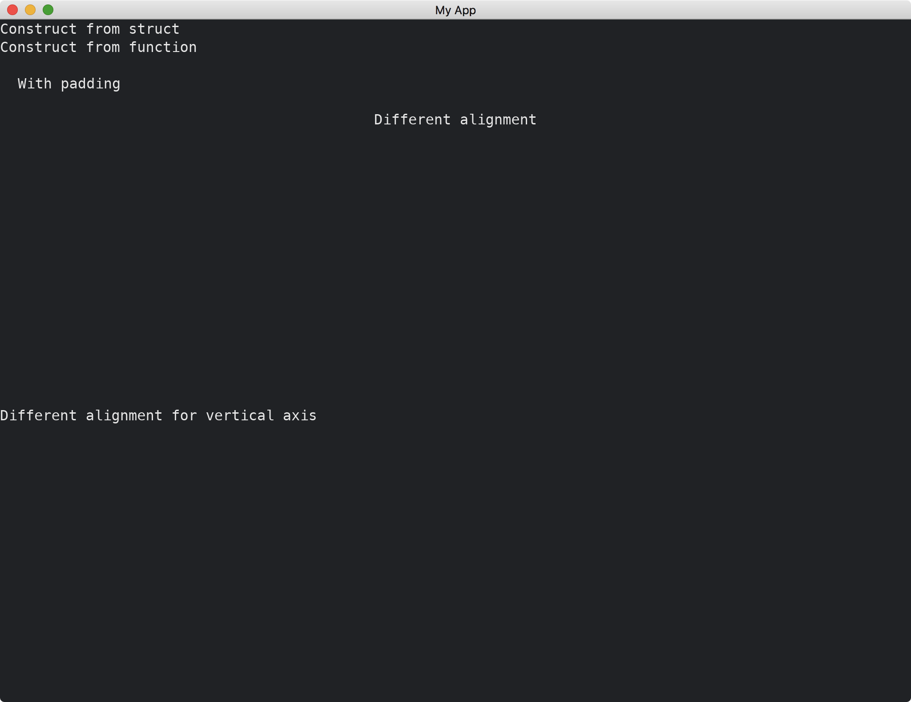

# Container

[Container](https://docs.rs/iced/0.12.1/iced/widget/container/struct.Container.html) is another way to help us laying out widgets, especially when we need to algin a widget center both horizontally and vertically.
[Container](https://docs.rs/iced/0.12.1/iced/widget/container/struct.Container.html) accepts any widget including [Column](https://docs.rs/iced/0.12.1/iced/widget/struct.Column.html) and [Row](https://docs.rs/iced/0.12.1/iced/widget/struct.Row.html).

```rust
use iced::{
    alignment::{Horizontal, Vertical},
    widget::{column, container, Container},
    Length, Sandbox, Settings,
};

fn main() -> iced::Result {
    MyApp::run(Settings::default())
}

struct MyApp;

impl Sandbox for MyApp {
    type Message = ();

    fn new() -> Self {
        Self
    }

    fn title(&self) -> String {
        String::from("My App")
    }

    fn update(&mut self, _message: Self::Message) {}

    fn view(&self) -> iced::Element<Self::Message> {
        column![
            Container::new("Construct from struct"),
            container("Construct from function"),
            container("With padding").padding(20),
            container("Different alignment")
                .width(Length::Fill)
                .align_x(Horizontal::Center),
            container("Different alignment for vertical axis")
                .height(Length::Fill)
                .align_y(Vertical::Center),
        ]
        .into()
    }
}
```



If we want to center a widget both horizontally and vertically, we can use the following code:

```rust
container("Center").width(Length::Fill).height(Length::Fill).center_x().center_y()
```

:arrow_right:  Next: [Scrollable](./scrollable.md)

:blue_book: Back: [Table of contents](./../README.md)
