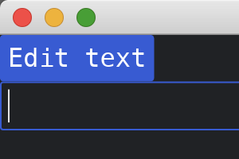

# Controlling Widgets behavior

Some widgets cannot rely solely on state for some behavior changes. Take the [`TextInput`](https://docs.rs/iced/0.13.1/iced/widget/text_input/struct.TextInput.html), for example. Setting focus to a text input is not dependent on state. It's a one shot function call and the result is expected to simply work, assuming the text input exists.

The text input widget in Iced has a [focus](https://docs.rs/iced/0.13.1/iced/widget/text_input/fn.focus.html) function for this exact scenario. It takes an [text_input::Id](https://docs.rs/iced/0.13.1/iced/widget/text_input/struct.Id.html) as parameter, which is the id of the input. Before being able to set focus, we must set the id of the input by calling the [id](https://docs.rs/iced/0.13.1/iced/widget/text_input/struct.TextInput.html#method.id) function.

Once everything is set, we can call [focus](https://docs.rs/iced/0.13.1/iced/widget/text_input/fn.focus.html) passing the Id of the input.

Note on the below example that the update function in our `MyApp` returns a task. When this is the case, we must return a `Task::none()` after our `match` to satisfy the type constraint. Not all messages will return tasks, after all.


```rust
use iced::{
    Task,
    widget::{button, column, text_input},
};

fn main() -> iced::Result {
    iced::run("My App", MyApp::update, MyApp::view)
}

const MY_TEXT_ID: &str = "my_text";

#[derive(Debug, Clone)]
enum Message {
    EditText,
    UpdateText(String),
}

#[derive(Default)]
struct MyApp {
    some_text: String,
}

impl MyApp {
    fn update(&mut self, message: Message) -> Task<Message> {
        match message {
            Message::EditText => return text_input::focus(text_input::Id::new(MY_TEXT_ID)),
            Message::UpdateText(s) => self.some_text = s,
        }
        Task::none()
    }

    fn view(&self) -> iced::Element<Message> {
        column![
            button("Edit text").on_press(Message::EditText),
            text_input("", &self.some_text)
                .id(text_input::Id::new(MY_TEXT_ID))
                .on_input(Message::UpdateText),
        ]
        .into()
    }
}
```



:arrow_right:  Next: [Dispatching Tasks at Startup](./dispatching_tasks_at_startup.md)

:blue_book: Back: [Table of contents](./../README.md)
