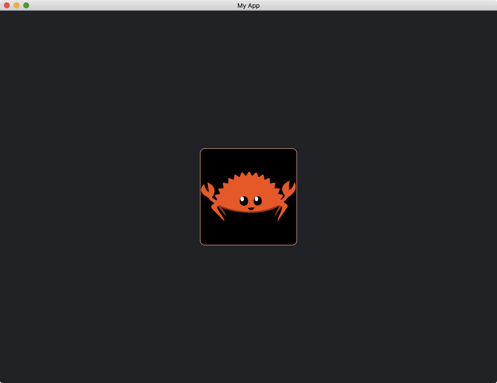

# Custom Background

We can also draw an image on a [Widget](https://docs.rs/iced/0.12.1/iced/advanced/widget/trait.Widget.html).

Similar to the [Image](https://docs.rs/iced/0.12.1/iced/widget/image/struct.Image.html) widget, we have to enable the [image](https://docs.rs/crate/iced/latest/features#image) feature.

```toml
[dependencies]
iced = { version = "0.12.1", features = ["image", "advanced"] }
```

Assume we have an image, named `ferris.png`,  in the Cargo root directory.
We load this image when we initialize our widget.

```rust
struct MyWidgetWithImage {
    handle: Handle,
}

impl MyWidgetWithImage {
    fn new() -> Self {
        Self {
            handle: Handle::from_path("ferris.png"),
        }
    }
}
```

Then, we use the [iced::widget::image::layout](https://docs.rs/iced/0.12.1/iced/widget/image/fn.layout.html) function to determine the [layout](https://docs.rs/iced/0.12.1/iced/advanced/widget/trait.Widget.html#tymethod.layout) of our widget.

```rust
fn layout(&self, _tree: &mut Tree, renderer: &Renderer, limits: &layout::Limits) -> layout::Node {
    iced::widget::image::layout(
        renderer,
        limits,
        &self.handle,
        Length::Fixed(200.),
        Length::Fixed(200.),
        iced::ContentFit::Contain,
    )
}
```

And we draw the image by the [iced::widget::image::draw](https://docs.rs/iced/0.12.1/iced/widget/image/fn.draw.html) function.

```rust
fn draw(
    &self,
    _state: &Tree,
    renderer: &mut Renderer,
    _theme: &Renderer::Theme,
    _style: &renderer::Style,
    layout: Layout<'_>,
    _cursor: mouse::Cursor,
    _viewport: &Rectangle,
) {
    renderer.fill_quad(
        Quad {
            bounds: layout.bounds(),
            border: Border {
                color: Color::from_rgb(1.0, 0.66, 0.6),
                width: 1.0,
                radius: 10.0.into(),
            },
            shadow: Shadow::default(),
        },
        Color::BLACK,
    );

    iced::widget::image::draw(
        renderer,
        layout,
        &self.handle,
        iced::ContentFit::Contain,
        iced::widget::image::FilterMethod::Linear,
    );
}
```

Both functions require the `Renderer` to implement [iced::advanced::image::Renderer](https://docs.rs/iced/0.12.1/iced/advanced/image/trait.Renderer.html).

```rust
impl<Message, Renderer> Widget<Message, Theme, Renderer> for MyWidgetWithImage
where
    Renderer: iced::advanced::Renderer + iced::advanced::image::Renderer<Handle = Handle>,
```

The full code is as follows:

```rust
use iced::{
    advanced::{
        layout, mouse,
        renderer::{self, Quad},
        widget::Tree,
        Layout, Widget,
    },
    widget::{container, image::Handle, Theme},
    Border, Color, Element, Length, Rectangle, Sandbox, Settings, Shadow, Size,
};

fn main() -> iced::Result {
    MyApp::run(Settings::default())
}

struct MyApp;

impl Sandbox for MyApp {
    type Message = ();

    fn new() -> Self {
        Self
    }

    fn title(&self) -> String {
        String::from("My App")
    }

    fn update(&mut self, _message: Self::Message) {}

    fn view(&self) -> iced::Element<Self::Message> {
        container(MyWidgetWithImage::new())
            .width(Length::Fill)
            .height(Length::Fill)
            .center_x()
            .center_y()
            .into()
    }
}

struct MyWidgetWithImage {
    handle: Handle,
}

impl MyWidgetWithImage {
    fn new() -> Self {
        Self {
            handle: Handle::from_path("ferris.png"),
        }
    }
}

impl<Message, Renderer> Widget<Message, Theme, Renderer> for MyWidgetWithImage
where
    Renderer: iced::advanced::Renderer + iced::advanced::image::Renderer<Handle = Handle>,
{
    fn size(&self) -> Size<Length> {
        Size {
            width: Length::Shrink,
            height: Length::Shrink,
        }
    }

    fn layout(
        &self,
        _tree: &mut Tree,
        renderer: &Renderer,
        limits: &layout::Limits,
    ) -> layout::Node {
        iced::widget::image::layout(
            renderer,
            limits,
            &self.handle,
            Length::Fixed(200.),
            Length::Fixed(200.),
            iced::ContentFit::Contain,
        )
    }

    fn draw(
        &self,
        _state: &Tree,
        renderer: &mut Renderer,
        _theme: &Theme,
        _style: &renderer::Style,
        layout: Layout<'_>,
        _cursor: mouse::Cursor,
        _viewport: &Rectangle,
    ) {
        renderer.fill_quad(
            Quad {
                bounds: layout.bounds(),
                border: Border {
                    color: Color::from_rgb(1.0, 0.66, 0.6),
                    width: 1.0,
                    radius: 10.0.into(),
                },
                shadow: Shadow::default(),
            },
            Color::BLACK,
        );

        iced::widget::image::draw(
            renderer,
            layout,
            &self.handle,
            iced::ContentFit::Contain,
            iced::widget::image::FilterMethod::Linear,
        );
    }
}

impl<'a, Message, Renderer> From<MyWidgetWithImage> for Element<'a, Message, Theme, Renderer>
where
    Renderer: iced::advanced::Renderer + iced::advanced::image::Renderer<Handle = Handle>,
{
    fn from(widget: MyWidgetWithImage) -> Self {
        Self::new(widget)
    }
}
```



:arrow_right:  Next: [Widgets With Children](./widgets_with_children.md)

:blue_book: Back: [Table of contents](./../README.md)
