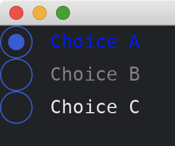

# Custom Styles

We mentioned in the [previous tutorial](./changing_styles.md) about how to change styles of widgets by the [enums](https://doc.rust-lang.org/std/keyword.enum.html) in [theme](https://docs.rs/iced/0.12.1/iced/theme/index.html) module.
Most [enums](https://doc.rust-lang.org/std/keyword.enum.html) in [theme](https://docs.rs/iced/0.12.1/iced/theme/index.html) module support `Custom` variant, e.g., [theme::Radio::Custom(...)](https://docs.rs/iced/0.12.1/iced/theme/enum.Radio.html#variant.Custom).
This variant takes [radio::StyleSheet](https://docs.rs/iced/0.12.1/iced/widget/radio/trait.StyleSheet.html) trait as its parameter.
To use the variant, we need to implement the trait (such as `RadioStyle` struct in the following code).
The [associated type](https://doc.rust-lang.org/stable/book/ch19-03-advanced-traits.html#specifying-placeholder-types-in-trait-definitions-with-associated-types) of the trait should be set to [iced::Theme](https://docs.rs/iced/0.12.1/iced/enum.Theme.html).
The methods in the trait return [radio::Appearance](https://docs.rs/iced/0.12.1/iced/widget/radio/struct.Appearance.html).
We can use [theme::Radio::Default](https://docs.rs/iced/0.12.1/iced/theme/enum.Radio.html#variant.Default) to obtain the default value of [radio::Appearance](https://docs.rs/iced/0.12.1/iced/widget/radio/struct.Appearance.html), e.g., `style.active(&theme::Radio::Default, is_selected)`.
After that, we can modify the default [radio::Appearance](https://docs.rs/iced/0.12.1/iced/widget/radio/struct.Appearance.html) based on our needs.

```rust
use iced::{
    theme,
    widget::{column, radio},
    Color, Sandbox, Settings,
};

fn main() -> iced::Result {
    MyApp::run(Settings::default())
}

#[derive(Debug, Clone)]
enum MyAppMessage {
    Choose(String),
}

struct MyApp;

impl Sandbox for MyApp {
    type Message = MyAppMessage;

    fn new() -> Self {
        Self
    }

    fn title(&self) -> String {
        String::from("My App")
    }

    fn update(&mut self, _message: Self::Message) {}

    fn view(&self) -> iced::Element<Self::Message> {
        column![
            radio("Choice A", "A", Some("A"), |s| MyAppMessage::Choose(
                s.to_string()
            ))
            .style(theme::Radio::Custom(Box::new(RadioStyle))),
            radio("Choice B", "B", Some("A"), |s| MyAppMessage::Choose(
                s.to_string()
            ))
            .style(theme::Radio::Custom(Box::new(RadioStyle))),
            radio("Choice C", "C", Some("A"), |s| MyAppMessage::Choose(
                s.to_string()
            )),
        ]
        .into()
    }
}

struct RadioStyle;

impl radio::StyleSheet for RadioStyle {
    type Style = iced::Theme;

    fn active(&self, style: &Self::Style, is_selected: bool) -> radio::Appearance {
        radio::Appearance {
            text_color: Some(if is_selected {
                Color::from_rgb(0., 0., 1.)
            } else {
                Color::from_rgb(0.5, 0.5, 0.5)
            }),
            ..style.active(&theme::Radio::Default, is_selected)
        }
    }

    fn hovered(&self, style: &Self::Style, is_selected: bool) -> radio::Appearance {
        style.hovered(&theme::Radio::Default, is_selected)
    }
}
```



:arrow_right:  Next: [More Than One Page](./more_than_one_page.md)

:blue_book: Back: [Table of contents](./../README.md)
