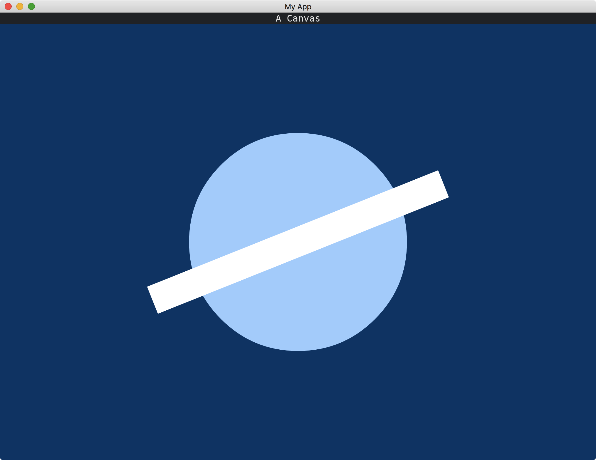

# Drawing Shapes

[Canvas](https://docs.rs/iced/0.13.1/iced/widget/canvas/struct.Canvas.html) is a widget that helps us drawing free-style shapes.
To use the widget, we need to enable the [canvas](https://docs.rs/crate/iced/0.13.1/features#canvas) feature.

```toml
[dependencies]
iced = { version = "0.13.1", features = ["canvas"] }
```

We use [Canvas::new](https://docs.rs/iced/0.13.1/iced/widget/canvas/struct.Canvas.html#method.new) to obtain the canvas widget. This function accepts a [Program](https://docs.rs/iced/0.13.1/iced/widget/canvas/trait.Program.html) trait. The difference between a program and an application is that a program brings much more control over drawing, updating and event dispatching, at the cost of more complexity.

We can create a struct (say, `MyProgram`) to implement this trait.

```rust
impl<Message> Program<Message> for MyProgram {
    type State = ();

    fn draw(
        &self,
        _state: &Self::State,
        renderer: &Renderer,
        _theme: &Theme,
        bounds: Rectangle,
        _cursor: mouse::Cursor,
    ) -> Vec<Geometry> {
        // ...
    }
}
```

We need to provide a generic data type `Message` when we implement the [Program](https://docs.rs/iced/0.13.1/iced/widget/canvas/trait.Program.html) trait. This helps us adapting to our `Message` used by our applications.

The associated type [State](https://docs.rs/iced/0.13.1/iced/widget/canvas/trait.Program.html#associatedtype.State) is not used in our example, so we set it to `()`.

The most important part of [Program](https://docs.rs/iced/0.13.1/iced/widget/canvas/trait.Program.html) is the [draw](https://docs.rs/iced/0.13.1/iced/widget/canvas/trait.Program.html#tymethod.draw) method.
In this method, we define what shapes we are going to be drawn.

To actually draw a shape, we need to use a pointer. Think of it as a pen. [Frame](https://docs.rs/iced/0.13.1/iced/widget/canvas/type.Frame.html) is the enum we are going to use for that.

For example, we use the [fill_rectangle](https://docs.rs/iced/0.13.1/iced/widget/canvas/type.Frame.html#method.fill_rectangle) method of [Frame](https://docs.rs/iced/0.13.1/iced/widget/canvas/type.Frame.html) to draw a filled rectangle.
Or we can stroke and fill any [Path](https://docs.rs/iced/0.13.1/iced/widget/canvas/struct.Path.html).
Finally, we use the [into_geometry](https://docs.rs/iced/0.13.1/iced/widget/canvas/type.Frame.html#method.into_geometry) method of [Frame](https://docs.rs/iced/0.13.1/iced/widget/canvas/type.Frame.html) to return the [Geometry](https://docs.rs/iced/0.13.1/iced/widget/canvas/type.Geometry.html) as required by the [draw](https://docs.rs/iced/0.13.1/iced/widget/canvas/trait.Program.html#tymethod.draw) method.

```rust
use iced::{
    Alignment, Color, Length, Point, Rectangle, Renderer, Theme, Vector, mouse,
    widget::{
        Canvas,
        canvas::{Frame, Geometry, Path, Program, Stroke},
        column,
    },
};

fn main() -> iced::Result {
    iced::run("My App", MyApp::update, MyApp::view)
}

#[derive(Clone, Debug)]
enum Message {}

#[derive(Default)]
struct MyApp;

impl MyApp {
    fn update(&mut self, _message: Message) {}

    fn view(&self) -> iced::Element<Message> {
        column![
            "A Canvas",
            Canvas::new(MyProgram)
                .width(Length::Fill)
                .height(Length::Fill)
        ]
        .align_x(Alignment::Center)
        .into()
    }
}

struct MyProgram;

impl<Message> Program<Message> for MyProgram {
    type State = ();

    fn draw(
        &self,
        _state: &Self::State,
        renderer: &Renderer,
        _theme: &Theme,
        bounds: Rectangle,
        _cursor: mouse::Cursor,
    ) -> Vec<Geometry> {
        let mut frame = Frame::new(renderer, bounds.size());

        frame.fill_rectangle(Point::ORIGIN, bounds.size(), Color::from_rgb(0.0, 0.2, 0.4));

        frame.fill(
            &Path::circle(frame.center(), frame.width().min(frame.height()) / 4.0),
            Color::from_rgb(0.6, 0.8, 1.0),
        );

        frame.stroke(
            &Path::line(
                frame.center() + Vector::new(-250.0, 100.0),
                frame.center() + Vector::new(250.0, -100.0),
            ),
            Stroke {
                style: Color::WHITE.into(),
                width: 50.0,
                ..Default::default()
            },
        );

        vec![frame.into_geometry()]
    }
}
```



:arrow_right:  Next: [Drawing With Caches](./drawing_with_caches.md)

:blue_book: Back: [Table of contents](./../README.md)
