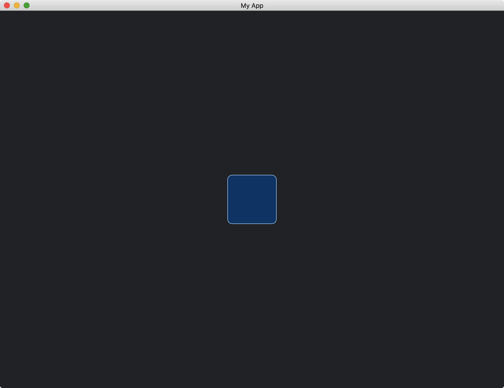

# Drawing Widgets

In addition to the build-in widgets, we can also design our own custom widgets.
To do so, we need to enable the [advanced](https://docs.rs/crate/iced/latest/features#advanced) feature.
The dependencies of the `Cargo.toml` file should look like this:

```toml
[dependencies]
iced = { version = "0.10.0", features = ["advanced"] }
```

Then, we need a struct that implement [Widget](https://docs.rs/iced/latest/iced/advanced/widget/trait.Widget.html) trait.

```rust
struct MyWidget;

impl<Message, Renderer> Widget<Message, Renderer> for MyWidget
where
    Renderer: iced::advanced::Renderer,
{
    fn width(&self) -> Length {
        // ...
    }

    fn height(&self) -> Length {
        // ...
    }

    fn layout(&self, _renderer: &Renderer, _limits: &layout::Limits) -> layout::Node {
        // ...
    }

    fn draw(
        &self,
        _state: &Tree,
        _renderer: &mut Renderer,
        _theme: &Renderer::Theme,
        _style: &renderer::Style,
        _layout: Layout<'_>,
        _cursor: mouse::Cursor,
        _viewport: &Rectangle,
    ) {
        // ...
    }
}
```

We define the size of `MyWidget` by the methods: [width](https://docs.rs/iced/0.10.0/iced/advanced/widget/trait.Widget.html#tymethod.width), [height](https://docs.rs/iced/0.10.0/iced/advanced/widget/trait.Widget.html#tymethod.height) and [layout](https://docs.rs/iced/latest/iced/advanced/widget/trait.Widget.html#tymethod.layout).
Currently, we set the [width](https://docs.rs/iced/0.10.0/iced/advanced/widget/trait.Widget.html#tymethod.width) and [height](https://docs.rs/iced/0.10.0/iced/advanced/widget/trait.Widget.html#tymethod.height) to [Length::Shrink](https://docs.rs/iced/latest/iced/enum.Length.html#variant.Shrink), to tell the layout system that we use the least space for this widget.

```rust
fn width(&self) -> Length {
    Length::Shrink
}

fn height(&self) -> Length {
    Length::Shrink
}
```

Then, we tell the layout system the precise size we are going to use for the widget.
In this example, our widget is of size `(100, 100)`.

```rust
fn layout(&self, _renderer: &Renderer, _limits: &layout::Limits) -> layout::Node {
    layout::Node::new([100, 100].into())
}
```

Usually, the [layout](https://docs.rs/iced/latest/iced/advanced/widget/trait.Widget.html#tymethod.layout) method would consider the [Limits](https://docs.rs/iced/latest/iced/advanced/layout/struct.Limits.html) parameter, which is the constraints from the layout system.
But now, we ignore it for simplicity.

Next, we draw our widget in the [draw](https://docs.rs/iced/latest/iced/advanced/widget/trait.Widget.html#tymethod.draw) method.
We use the given [Renderer](https://docs.rs/iced/latest/iced/advanced/trait.Renderer.html) to do so.
One may refer to the given [Theme](https://docs.rs/iced/0.10.0/iced/advanced/trait.Renderer.html#associatedtype.Theme) and [Style](https://docs.rs/iced/latest/iced/advanced/renderer/struct.Style.html) for the colors of the widget.

```rust
fn draw(
    &self,
    _state: &Tree,
    renderer: &mut Renderer,
    _theme: &Renderer::Theme,
    _style: &renderer::Style,
    layout: Layout<'_>,
    _cursor: mouse::Cursor,
    _viewport: &Rectangle,
) {
    renderer.fill_quad(
        Quad {
            bounds: layout.bounds(),
            border_radius: 10.0.into(),
            border_width: 1.0,
            border_color: Color::from_rgb(0.6, 0.8, 1.0),
        },
        Color::from_rgb(0.0, 0.2, 0.4),
    );
}
```

The given [Layout](https://docs.rs/iced/latest/iced/advanced/struct.Layout.html) parameter would be calculated automatically by the layout system according to the [width](https://docs.rs/iced/0.10.0/iced/advanced/widget/trait.Widget.html#tymethod.width), [height](https://docs.rs/iced/0.10.0/iced/advanced/widget/trait.Widget.html#tymethod.height) and [layout](https://docs.rs/iced/latest/iced/advanced/widget/trait.Widget.html#tymethod.layout) methods we defined before.

For convenience, we can implement `From<MyWidget>` for [Element](https://docs.rs/iced/latest/iced/type.Element.html).

```rust
impl<'a, Message, Renderer> From<MyWidget> for Element<'a, Message, Renderer>
where
    Renderer: iced::advanced::Renderer,
{
    fn from(widget: MyWidget) -> Self {
        Self::new(widget)
    }
}
```

Finally, the widget can be added to our app by the following code.

```rust
fn view(&self) -> iced::Element<'_, Self::Message> {
    container(MyWidget)
        .width(Length::Fill)
        .height(Length::Fill)
        .center_x()
        .center_y()
        .into()
}
```

Note that it is not necessary to put `MyWidget` in a [Container](https://docs.rs/iced/latest/iced/widget/container/struct.Container.html).
We can add the widget directly into our app.

```rust
fn view(&self) -> iced::Element<'_, Self::Message> {
    MyWidget.into()
}
```

The full code is as follows:

```rust
use iced::{
    advanced::{
        layout, mouse,
        renderer::{self, Quad},
        widget::Tree,
        Layout, Widget,
    },
    widget::container,
    Color, Element, Length, Rectangle, Sandbox, Settings,
};

fn main() -> iced::Result {
    MyApp::run(Settings::default())
}

struct MyApp;

impl Sandbox for MyApp {
    type Message = ();

    fn new() -> Self {
        Self
    }

    fn title(&self) -> String {
        String::from("My App")
    }

    fn update(&mut self, _message: Self::Message) {}

    fn view(&self) -> iced::Element<'_, Self::Message> {
        container(MyWidget)
            .width(Length::Fill)
            .height(Length::Fill)
            .center_x()
            .center_y()
            .into()
    }
}

struct MyWidget;

impl<Message, Renderer> Widget<Message, Renderer> for MyWidget
where
    Renderer: iced::advanced::Renderer,
{
    fn width(&self) -> Length {
        Length::Shrink
    }

    fn height(&self) -> Length {
        Length::Shrink
    }

    fn layout(&self, _renderer: &Renderer, _limits: &layout::Limits) -> layout::Node {
        layout::Node::new([100, 100].into())
    }

    fn draw(
        &self,
        _state: &Tree,
        renderer: &mut Renderer,
        _theme: &Renderer::Theme,
        _style: &renderer::Style,
        layout: Layout<'_>,
        _cursor: mouse::Cursor,
        _viewport: &Rectangle,
    ) {
        renderer.fill_quad(
            Quad {
                bounds: layout.bounds(),
                border_radius: 10.0.into(),
                border_width: 1.0,
                border_color: Color::from_rgb(0.6, 0.8, 1.0),
            },
            Color::from_rgb(0.0, 0.2, 0.4),
        );
    }
}

impl<'a, Message, Renderer> From<MyWidget> for Element<'a, Message, Renderer>
where
    Renderer: iced::advanced::Renderer,
{
    fn from(widget: MyWidget) -> Self {
        Self::new(widget)
    }
}
```



:arrow_right:  Next: [Updating Widgets From Outside](./updating_widgets_from_outside.md)

:blue_book: Back: [Table of contents](./../README.md)
