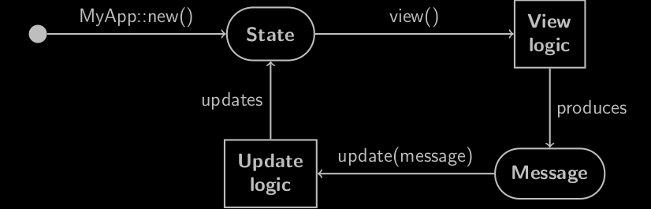

# Explanation of Sandbox Trait

[Sandbox](https://docs.rs/iced/0.12.1/iced/trait.Sandbox.html) works as follows.



This can also be seen in the following code.

```rust
#[derive(Debug, Clone)]
enum Message {
    // ...
}

struct MyApp {
    // ... (Some fields for the app state)
}

impl Sandbox for MyApp {
    type Message = Message;

    fn new() -> Self {
        Self {
            // ...
        }
    }

    fn title(&self) -> String {
        // Title of the window
    }

    fn update(&mut self, message: Self::Message) {
        match message {
            // Update logic
        }
    }

    fn view(&self) -> iced::Element<'_, Self::Message> {
        // View logic
    }
}
```

:arrow_right:  Next: [Adding Widgets](./adding_widgets.md)

:blue_book: Back: [Table of contents](./../README.md)
