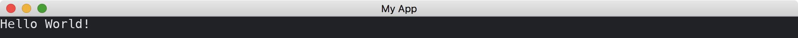

# From Sandbox To Application

To have more control over our app, we can use [Application](https://docs.iced.rs/iced/application/trait.Application.html) trait, which is a generalization of [Sandbox](https://docs.iced.rs/iced/trait.Sandbox.html) trait.
There are two main differences between [Application](https://docs.iced.rs/iced/application/trait.Application.html) and [Sandbox](https://docs.iced.rs/iced/trait.Sandbox.html).
One thing is the [associated types](https://doc.rust-lang.org/stable/book/ch19-03-advanced-traits.html#specifying-placeholder-types-in-trait-definitions-with-associated-types).
We have to specify [Executor](https://docs.iced.rs/iced/application/trait.Application.html#associatedtype.Executor), [Theme](https://docs.iced.rs/iced/application/trait.Application.html#associatedtype.Theme) and [Flags](https://docs.iced.rs/iced/application/trait.Application.html#associatedtype.Flags) in addition to [Message](https://docs.iced.rs/iced/trait.Sandbox.html#associatedtype.Message) in [Sandbox](https://docs.iced.rs/iced/trait.Sandbox.html).
Basically, we use the suggested defaults for these associated types.
The other is that we have to return [Command](https://docs.iced.rs/iced/struct.Command.html) in [new](https://docs.iced.rs/iced/application/trait.Application.html#tymethod.new) method and [update](https://docs.iced.rs/iced/application/trait.Application.html#tymethod.update) method.
We just return [Command::none()](https://docs.iced.rs/iced/struct.Command.html#method.none) for both methods.

```rust
use iced::{executor, Application, Command, Settings};

fn main() -> iced::Result {
    MyApp::run(Settings::default())
}

struct MyApp;

impl Application for MyApp {
    type Executor = executor::Default;
    type Message = ();
    type Theme = iced::Theme;
    type Flags = ();

    fn new(_flags: Self::Flags) -> (Self, iced::Command<Self::Message>) {
        (Self, Command::none())
    }

    fn title(&self) -> String {
        String::from("My App")
    }

    fn update(&mut self, _message: Self::Message) -> iced::Command<Self::Message> {
        Command::none()
    }

    fn view(&self) -> iced::Element<'_, Self::Message, iced::Renderer<Self::Theme>> {
        "Hello World!".into()
    }
}
```



:arrow_right:  Next: [Controlling Widgets By Commands](./controlling_widgets_by_commands.md)
