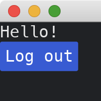
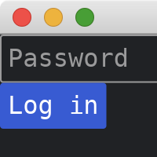

# Memoryless Pages

The [previous tutorial](./more_than_one_page.md) has a problem that the fields can still be accessed when we navigate to other pages.
This brings potential security problems, e.g., the input password could be accessed in other pages.

To fix this problem, we can use [trait objects](https://doc.rust-lang.org/stable/book/ch17-02-trait-objects.html).
The `Page` trait below is responsible for [update](https://docs.rs/iced/0.12.1/iced/trait.Sandbox.html#tymethod.update) and [view](https://docs.rs/iced/0.12.1/iced/trait.Sandbox.html#tymethod.view) for a single page.
In the main struct `MyApp`, we dispatch [update](https://docs.rs/iced/0.12.1/iced/trait.Sandbox.html#tymethod.update) and [view](https://docs.rs/iced/0.12.1/iced/trait.Sandbox.html#tymethod.view) to the corresponding page that is indicated by `page` field in `MyApp`.
The [update](https://docs.rs/iced/0.12.1/iced/trait.Sandbox.html#tymethod.update) method in `MyApp` is also responsible for switching pages.

In addition, we explicitly distinguish messages from different pages in `MyAppMessage`.

```rust
use iced::{
    widget::{button, column, text, text_input},
    Sandbox, Settings,
};

fn main() -> iced::Result {
    MyApp::run(Settings::default())
}

#[derive(Debug, Clone)]
enum MyAppMessage {
    PageA(PageAMessage),
    PageB(PageBMessage),
}

trait Page {
    fn update(&mut self, message: MyAppMessage) -> Option<Box<dyn Page>>;
    fn view(&self) -> iced::Element<'_, MyAppMessage>;
}

struct MyApp {
    page: Box<dyn Page>,
}

impl Sandbox for MyApp {
    type Message = MyAppMessage;

    fn new() -> Self {
        Self {
            page: Box::new(PageA::new()),
        }
    }

    fn title(&self) -> String {
        String::from("My App")
    }

    fn update(&mut self, message: Self::Message) {
        let page = self.page.update(message);
        if let Some(p) = page {
            self.page = p;
        }
    }

    fn view(&self) -> iced::Element<'_, Self::Message> {
        self.page.view()
    }
}
```

In this tutorial, we have two pages, `PageA` and `PageB`.
`PageA` is a simple login form and `PageB` is a simple hello page.
Let's start with `PageB`.
In its `update` method, we only care about messages of `PageBMessage`.

```rust
#[derive(Debug, Clone)]
enum PageBMessage {
    ButtonPressed,
}
type Mb = PageBMessage;

struct PageB;

impl PageB {
    fn new() -> Self {
        Self
    }
}

impl Page for PageB {
    fn update(&mut self, message: MyAppMessage) -> Option<Box<dyn Page>> {
        if let MyAppMessage::PageB(msg) = message {
            match msg {
                PageBMessage::ButtonPressed => return Some(Box::new(PageA::new())),
            }
        }
        None
    }

    fn view(&self) -> iced::Element<'_, MyAppMessage> {
        column![
            text("Hello!"),
            button("Log out").on_press(MyAppMessage::PageB(Mb::ButtonPressed)),
        ]
        .into()
    }
}
```



In `PageA`, we check the password when the login button is pressed.
If it is a valid password, we switch to `PageB`.
Note that `PageA` (and its `password` field) is dropped after we switch to `PageB`.
This ensures the password is protected.

```rust
#[derive(Debug, Clone)]
enum PageAMessage {
    TextChanged(String),
    ButtonPressed,
}
type Ma = PageAMessage;

struct PageA {
    password: String,
}

impl PageA {
    fn new() -> Self {
        Self {
            password: String::new(),
        }
    }
}

impl Page for PageA {
    fn update(&mut self, message: MyAppMessage) -> Option<Box<dyn Page>> {
        if let MyAppMessage::PageA(msg) = message {
            match msg {
                PageAMessage::TextChanged(s) => self.password = s,
                PageAMessage::ButtonPressed => {
                    if self.password == "abc" {
                        return Some(Box::new(PageB::new()));
                    }
                }
            }
        }
        None
    }

    fn view(&self) -> iced::Element<'_, MyAppMessage> {
        column![
            text_input("Password", &self.password)
                .secure(true)
                .on_input(|s| MyAppMessage::PageA(Ma::TextChanged(s))),
            button("Log in").on_press(MyAppMessage::PageA(Ma::ButtonPressed)),
        ]
        .into()
    }
}
```



:arrow_right:  Next: [Passing Parameters Across Pages](./passing_parameters_across_pages.md)

:blue_book: Back: [Table of contents](./../README.md)
