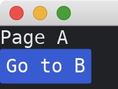
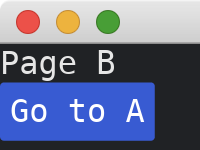

# More Than One Page

To have multiple pages, we can add a field `page` to the main struct `MyApp`.
The field `page` is an [enum](https://doc.rust-lang.org/std/keyword.enum.html) defined by us that decides what to display in [view](https://docs.rs/iced/0.12.1/iced/trait.Sandbox.html#tymethod.view) method of the [Sandbox](https://docs.rs/iced/0.12.1/iced/trait.Sandbox.html).

```rust
use iced::{
    widget::{button, column, text},
    Sandbox, Settings,
};

fn main() -> iced::Result {
    MyApp::run(Settings::default())
}

enum Page {
    A,
    B,
}

#[derive(Debug, Clone)]
enum MyAppMessage {
    GoToBButtonPressed,
    GoToAButtonPressed,
}

struct MyApp {
    page: Page,
}

impl Sandbox for MyApp {
    type Message = MyAppMessage;

    fn new() -> Self {
        Self { page: Page::A }
    }

    fn title(&self) -> String {
        String::from("My App")
    }

    fn update(&mut self, message: Self::Message) {
        self.page = match message {
            MyAppMessage::GoToBButtonPressed => Page::B,
            MyAppMessage::GoToAButtonPressed => Page::A,
        }
    }

    fn view(&self) -> iced::Element<'_, Self::Message> {
        match self.page {
            Page::A => column![
                text("Page A"),
                button("Go to B").on_press(MyAppMessage::GoToBButtonPressed),
            ],
            Page::B => column![
                text("Page B"),
                button("Go to A").on_press(MyAppMessage::GoToAButtonPressed),
            ],
        }
        .into()
    }
}
```

Page A:



And page B:



:arrow_right:  Next: [Memoryless Pages](./memoryless_pages.md)

:blue_book: Back: [Table of contents](./../README.md)
