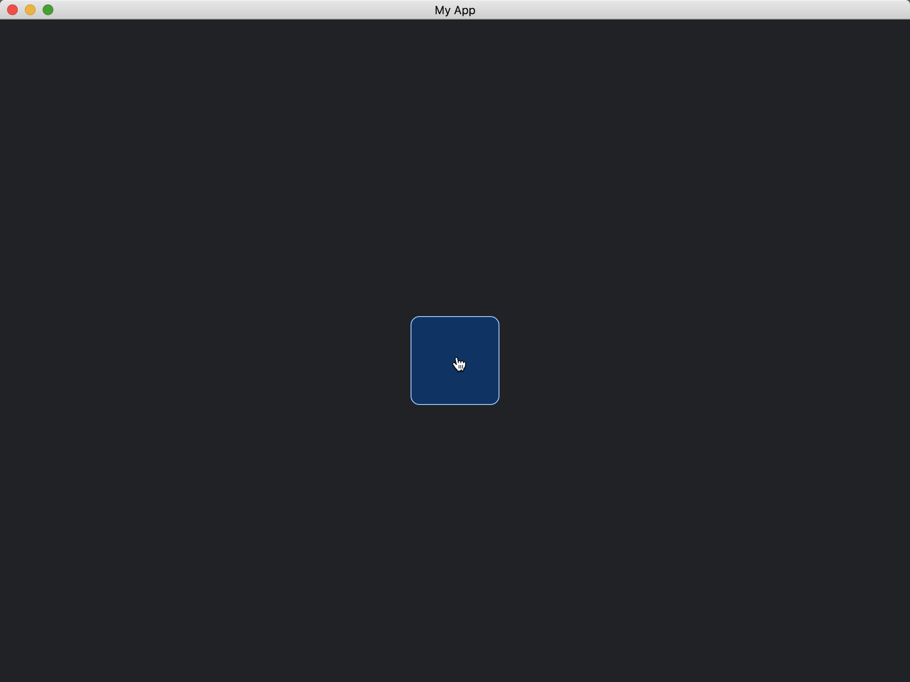

# Mouse Pointer Over Widgets

To change the mouse pointer based on the requirement of our widgets, we can use the [mouse_interaction](https://docs.rs/iced/0.13.1/iced/advanced/widget/trait.Widget.html#method.mouse_interaction) method of [Widget](https://docs.rs/iced/0.13.1/iced/advanced/widget/trait.Widget.html).

```rust
fn mouse_interaction(
    &self,
    _state: &Tree,
    layout: Layout<'_>,
    cursor: mouse::Cursor,
    _viewport: &Rectangle,
    _renderer: &Renderer,
) -> mouse::Interaction {
    if cursor.is_over(layout.bounds()) {
        mouse::Interaction::Pointer
    } else {
        mouse::Interaction::Idle
    }
}
```

The method returns [Interaction](https://docs.rs/iced/0.13.1/iced/mouse/enum.Interaction.html), which specifies the type of the mouse pointer.
In our example, we specify [Interaction::Pointer](https://docs.rs/iced/0.13.1/iced/mouse/enum.Interaction.html#variant.Pointer) when the mouse is over the widget.

The full code is as follows:

```rust
use iced::{
    Border, Color, Element, Length, Rectangle, Shadow, Size, Theme,
    advanced::{
        Layout, Widget, layout, mouse,
        renderer::{self, Quad},
        widget::Tree,
    },
    widget::container,
};

fn main() -> iced::Result {
    iced::run("My App", MyApp::update, MyApp::view)
}

#[derive(Debug, Clone)]
enum Message {}

#[derive(Default)]
struct MyApp;

impl MyApp {
    fn update(&mut self, _message: Message) {}

    fn view(&self) -> iced::Element<Message> {
        container(MyWidget)
            .width(Length::Fill)
            .height(Length::Fill)
            .center_x(Length::Fill)
            .center_y(Length::Fill)
            .into()
    }
}

struct MyWidget;

impl<Message, Renderer> Widget<Message, Theme, Renderer> for MyWidget
where
    Renderer: iced::advanced::Renderer,
{
    fn size(&self) -> Size<Length> {
        Size {
            width: Length::Shrink,
            height: Length::Shrink,
        }
    }

    fn layout(
        &self,
        _tree: &mut Tree,
        _renderer: &Renderer,
        _limits: &layout::Limits,
    ) -> layout::Node {
        layout::Node::new(iced::Size {
            width: 100.0,
            height: 100.0,
        })
    }

    fn draw(
        &self,
        _state: &Tree,
        renderer: &mut Renderer,
        _theme: &Theme,
        _style: &renderer::Style,
        layout: Layout<'_>,
        _cursor: mouse::Cursor,
        _viewport: &Rectangle,
    ) {
        renderer.fill_quad(
            Quad {
                bounds: layout.bounds(),
                border: Border {
                    color: Color::from_rgb(0.6, 0.8, 1.0),
                    width: 1.0,
                    radius: 10.0.into(),
                },
                shadow: Shadow::default(),
            },
            Color::from_rgb(0.0, 0.2, 0.4),
        );
    }

    fn mouse_interaction(
        &self,
        _state: &Tree,
        layout: Layout<'_>,
        cursor: mouse::Cursor,
        _viewport: &Rectangle,
        _renderer: &Renderer,
    ) -> mouse::Interaction {
        if cursor.is_over(layout.bounds()) {
            mouse::Interaction::Pointer
        } else {
            mouse::Interaction::Idle
        }
    }
}

impl<'a, Message, Renderer> From<MyWidget> for Element<'a, Message, Theme, Renderer>
where
    Renderer: iced::advanced::Renderer,
{
    fn from(widget: MyWidget) -> Self {
        Self::new(widget)
    }
}
```



:arrow_right:  Next: [Texts In Widgets](./texts_in_widgets.md)

:blue_book: Back: [Table of contents](./../README.md)
