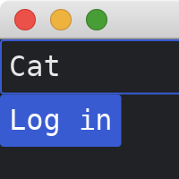
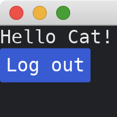

# Passing Parameters Across Pages

This tutorial follows the [previous tutorial](./memoryless_pages.md).
We use the same `Page` trait and `MyApp` struct.

```rust
use iced::{
    widget::{button, column, text, text_input},
    Sandbox, Settings,
};

fn main() -> iced::Result {
    MyApp::run(Settings::default())
}

#[derive(Debug, Clone)]
enum MyAppMessage {
    PageA(PageAMessage),
    PageB(PageBMessage),
}

trait Page {
    fn update(&mut self, message: MyAppMessage) -> Option<Box<dyn Page>>;
    fn view(&self) -> iced::Element<'_, MyAppMessage>;
}

struct MyApp {
    page: Box<dyn Page>,
}

impl Sandbox for MyApp {
    type Message = MyAppMessage;

    fn new() -> Self {
        Self {
            page: Box::new(PageA::new()),
        }
    }

    fn title(&self) -> String {
        String::from("My App")
    }

    fn update(&mut self, message: Self::Message) {
        let page = self.page.update(message);
        if let Some(p) = page {
            self.page = p;
        }
    }

    fn view(&self) -> iced::Element<'_, Self::Message> {
        self.page.view()
    }
}
```

For `PageA` (the login form), we have a [TextInput](https://docs.rs/iced/0.12.1/iced/widget/struct.TextInput.html) for names and a submit [Button](https://docs.rs/iced/0.12.1/iced/widget/struct.Button.html).
We pass `name` field of `PageA` to `new` function of `PageB` when we press the submit button.

```rust
#[derive(Debug, Clone)]
enum PageAMessage {
    TextChanged(String),
    ButtonPressed,
}
type Ma = PageAMessage;

struct PageA {
    name: String,
}

impl PageA {
    fn new() -> Self {
        Self {
            name: String::new(),
        }
    }
}

impl Page for PageA {
    fn update(&mut self, message: MyAppMessage) -> Option<Box<dyn Page>> {
        if let MyAppMessage::PageA(msg) = message {
            match msg {
                PageAMessage::TextChanged(s) => self.name = s,
                PageAMessage::ButtonPressed => {
                    return Some(Box::new(PageB::new(self.name.clone())))
                }
            }
        }
        None
    }

    fn view(&self) -> iced::Element<'_, MyAppMessage> {
        column![
            text_input("Name", &self.name).on_input(|s| MyAppMessage::PageA(Ma::TextChanged(s))),
            button("Log in").on_press(MyAppMessage::PageA(Ma::ButtonPressed)),
        ]
        .into()
    }
}
```



In `PageB`, we receive the name from `new` function and display the name in `view`.

```rust
#[derive(Debug, Clone)]
enum PageBMessage {
    ButtonPressed,
}
type Mb = PageBMessage;

struct PageB {
    name: String,
}

impl PageB {
    fn new(name: String) -> Self {
        Self { name }
    }
}

impl Page for PageB {
    fn update(&mut self, message: MyAppMessage) -> Option<Box<dyn Page>> {
        if let MyAppMessage::PageB(msg) = message {
            match msg {
                PageBMessage::ButtonPressed => return Some(Box::new(PageA::new())),
            }
        }
        None
    }

    fn view(&self) -> iced::Element<'_, MyAppMessage> {
        column![
            text(format!("Hello {}!", self.name)),
            button("Log out").on_press(MyAppMessage::PageB(Mb::ButtonPressed)),
        ]
        .into()
    }
}
```



:arrow_right:  Next: [Navigation History](./navigation_history.md)

:blue_book: Back: [Table of contents](./../README.md)
