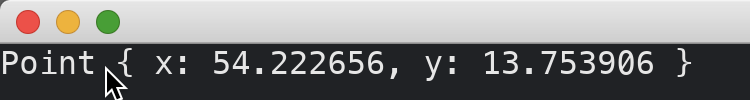

# Producing Messages By Mouse Events

To capture events of the window, we implement [subscription](https://docs.rs/iced/0.13.1/iced/application/struct.Application.html#method.subscription) by instantiating an application with the [`iced::application`](https://docs.rs/iced/0.13.1/iced/fn.application.html) function.
We need to pass to this function a function that returns a [Subscription](https://docs.rs/iced/0.13.1/iced/struct.Subscription.html). This function receives as parameter the application state itself.

We can use [listen_with](https://docs.rs/iced/0.13.1/iced/event/fn.listen_with.html) function to construct a [Subscription](https://docs.rs/iced/0.13.1/iced/struct.Subscription.html).
The [listen_with](https://docs.rs/iced/0.13.1/iced/event/fn.listen_with.html) function takes a function as its input.
The input function takes three parameters, [Event](https://docs.rs/iced/0.13.1/iced/event/enum.Event.html), [Status](https://docs.rs/iced/0.13.1/iced/event/enum.Status.html), and the [`Id`](https://docs.rs/iced/0.13.1/iced/window/struct.Id.html) of the window. It returns an [Option](https://doc.rust-lang.org/std/option/enum.Option.html)\<`Message`>, which means this function is capable of transforming [Event](https://docs.rs/iced/0.13.1/iced/event/enum.Event.html) to `Message`.

We then receive the transformed `Message` in the update method of our application.

In the input function, we only care about ignored events (i.e., events that is not handled by widgets) by checking if [Status](https://docs.rs/iced/0.13.1/iced/widget/canvas/event/enum.Status.html) is [Status::Ignored](https://docs.rs/iced/0.13.1/iced/widget/canvas/event/enum.Status.html#variant.Ignored).

In this tutorial, we capture [Event::Mouse(...)](https://docs.rs/iced/0.13.1/iced/enum.Event.html#variant.Mouse) and [Event::Touch(...)](https://docs.rs/iced/0.13.1/iced/enum.Event.html#variant.Touch) and produce messages.

```rust
use iced::{
    Point, Task,
    event::{self, Event, Status},
    mouse::Event::CursorMoved,
    touch::Event::FingerMoved,
    widget::text,
};

fn main() -> iced::Result {
    iced::application("My App", MyApp::update, MyApp::view)
        .subscription(MyApp::subscription)
        .run_with(MyApp::new)
}

#[derive(Debug, Clone)]
enum Message {
    PointUpdated(Point),
}

#[derive(Default)]
struct MyApp {
    mouse_point: Point,
}

impl MyApp {
    fn new() -> (Self, Task<Message>) {
        (
            Self {
                mouse_point: Point::ORIGIN,
            },
            Task::none(),
        )
    }

    fn update(&mut self, message: Message) -> Task<Message> {
        match message {
            Message::PointUpdated(p) => self.mouse_point = p,
        }
        Task::none()
    }

    fn view(&self) -> iced::Element<Message> {
        text(format!("{:?}", self.mouse_point)).into()
    }

    fn subscription(&self) -> iced::Subscription<Message> {
        event::listen_with(|event, status, _| match (event, status) {
            (Event::Mouse(CursorMoved { position }), Status::Ignored)
            | (Event::Touch(FingerMoved { position, .. }), Status::Ignored) => {
                Some(Message::PointUpdated(position))
            }
            _ => None,
        })
    }
}
```



:arrow_right:  Next: [Producing Messages By Keyboard Events](./producing_messages_by_keyboard_events.md)

:blue_book: Back: [Table of contents](./../README.md)
