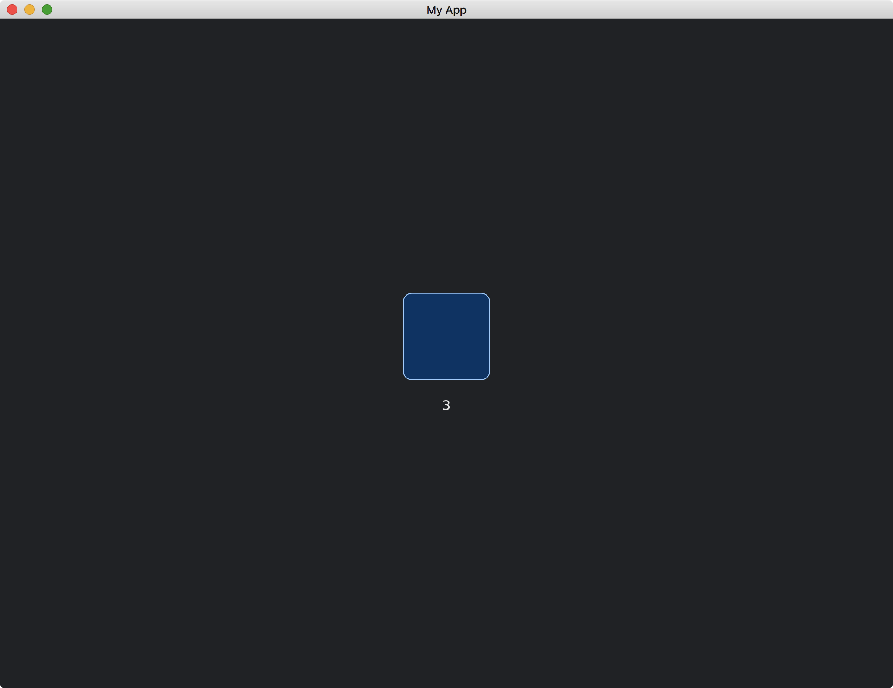

# Producing Widget Messages

Our custom widgets are able to send [Message](https://docs.rs/iced/latest/iced/trait.Sandbox.html#associatedtype.Message).

To do so, we need to store the [Message](https://docs.rs/iced/latest/iced/trait.Sandbox.html#associatedtype.Message) we are going to send in the widget.

```rust
struct MyWidget<Message> {
    pressed_message: Message,
}

impl<Message> MyWidget<Message> {
    fn new(pressed_message: Message) -> Self {
        Self { pressed_message }
    }
}
```

We use a generic type `Message` for `MyWidget`, so that the sent `pressed_message` in `MyWidget` will match the associated type [Message](https://docs.rs/iced/latest/iced/trait.Sandbox.html#associatedtype.Message) of [Sandbox](https://docs.rs/iced/latest/iced/trait.Sandbox.html).

The message `pressed_message` will be sent when the widget is pressed.

```rust
fn on_event(
    &mut self,
    _state: &mut Tree,
    event: Event,
    layout: Layout<'_>,
    cursor: mouse::Cursor,
    _renderer: &Renderer,
    _clipboard: &mut dyn Clipboard,
    shell: &mut Shell<'_, Message>,
    _viewport: &Rectangle,
) -> event::Status {
    if cursor.is_over(layout.bounds()) {
        match event {
            Event::Mouse(mouse::Event::ButtonPressed(_)) => {
                shell.publish(self.pressed_message.clone());
                event::Status::Captured
            }
            _ => event::Status::Ignored,
        }
    } else {
        event::Status::Ignored
    }
}
```

We use `shell.publish(self.pressed_message.clone())` to send `pressed_message` to our app.
To ensure the mouse pressed event happens within the range of the widget, we use `cursor.is_over(layout.bounds())` to check the mouse position and match the `event` to `Event::Mouse(mouse::Event::ButtonPressed(_))` to check the mouse button state.

Finally, we pass our [Message](https://docs.rs/iced/latest/iced/trait.Sandbox.html#associatedtype.Message) to the widget.

```rust
#[derive(Debug, Clone)]
enum MyMessage {
    MyWidgetPressed,
}

// ...

impl Sandbox for MyApp {
    type Message = MyMessage;

    // ...

    fn view(&self) -> iced::Element<'_, Self::Message> {
        container(
            column![
                MyWidget::new(MyMessage::MyWidgetPressed),
                // ...
            ]
            // ...
        )
        // ...
    }
}
```

The full code is as follows:

```rust
use iced::{
    advanced::{
        layout, mouse,
        renderer::{self, Quad},
        widget::Tree,
        Clipboard, Layout, Shell, Widget,
    },
    event,
    widget::{column, container, text},
    Alignment, Color, Element, Event, Length, Rectangle, Sandbox, Settings,
};

fn main() -> iced::Result {
    MyApp::run(Settings::default())
}

#[derive(Debug, Clone)]
enum MyMessage {
    MyWidgetPressed,
}

struct MyApp {
    count: u32,
}

impl Sandbox for MyApp {
    type Message = MyMessage;

    fn new() -> Self {
        Self { count: 0 }
    }

    fn title(&self) -> String {
        String::from("My App")
    }

    fn update(&mut self, message: Self::Message) {
        match message {
            MyMessage::MyWidgetPressed => self.count += 1,
        }
    }

    fn view(&self) -> iced::Element<'_, Self::Message> {
        container(
            column![MyWidget::new(MyMessage::MyWidgetPressed), text(self.count),]
                .spacing(20)
                .align_items(Alignment::Center),
        )
        .width(Length::Fill)
        .height(Length::Fill)
        .center_x()
        .center_y()
        .into()
    }
}

struct MyWidget<Message> {
    pressed_message: Message,
}

impl<Message> MyWidget<Message> {
    fn new(pressed_message: Message) -> Self {
        Self { pressed_message }
    }
}

impl<Message, Renderer> Widget<Message, Renderer> for MyWidget<Message>
where
    Message: Clone,
    Renderer: iced::advanced::Renderer,
{
    fn width(&self) -> Length {
        Length::Shrink
    }

    fn height(&self) -> Length {
        Length::Shrink
    }

    fn layout(&self, _renderer: &Renderer, _limits: &layout::Limits) -> layout::Node {
        layout::Node::new([100, 100].into())
    }

    fn draw(
        &self,
        _state: &Tree,
        renderer: &mut Renderer,
        _theme: &Renderer::Theme,
        _style: &renderer::Style,
        layout: Layout<'_>,
        _cursor: mouse::Cursor,
        _viewport: &Rectangle,
    ) {
        renderer.fill_quad(
            Quad {
                bounds: layout.bounds(),
                border_radius: 10.0.into(),
                border_width: 1.0,
                border_color: Color::from_rgb(0.6, 0.8, 1.0),
            },
            Color::from_rgb(0.0, 0.2, 0.4),
        );
    }

    fn on_event(
        &mut self,
        _state: &mut Tree,
        event: Event,
        layout: Layout<'_>,
        cursor: mouse::Cursor,
        _renderer: &Renderer,
        _clipboard: &mut dyn Clipboard,
        shell: &mut Shell<'_, Message>,
        _viewport: &Rectangle,
    ) -> event::Status {
        if cursor.is_over(layout.bounds()) {
            match event {
                Event::Mouse(mouse::Event::ButtonPressed(_)) => {
                    shell.publish(self.pressed_message.clone());
                    event::Status::Captured
                }
                _ => event::Status::Ignored,
            }
        } else {
            event::Status::Ignored
        }
    }
}

impl<'a, Message, Renderer> From<MyWidget<Message>> for Element<'a, Message, Renderer>
where
    Message: 'a + Clone,
    Renderer: iced::advanced::Renderer,
{
    fn from(widget: MyWidget<Message>) -> Self {
        Self::new(widget)
    }
}
```



<!-- :arrow_right:  Next:  -->

:blue_book: Back: [Table of contents](./../README.md)
