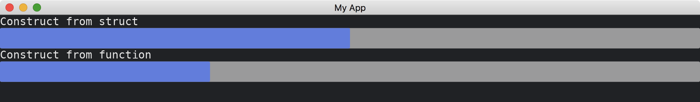

# ProgressBar

The [ProgressBar](https://docs.iced.rs/iced/widget/progress_bar/struct.ProgressBar.html) widget represents a value in a given range.
It has two methods of constructions.

```rust
use iced::{
    widget::{column, progress_bar, text, ProgressBar},
    Sandbox, Settings,
};

fn main() -> iced::Result {
    MyApp::run(Settings::default())
}

struct MyApp;

impl Sandbox for MyApp {
    type Message = ();

    fn new() -> Self {
        Self
    }

    fn title(&self) -> String {
        String::from("My App")
    }

    fn update(&mut self, _message: Self::Message) {}

    fn view(&self) -> iced::Element<'_, Self::Message> {
        column![
            text("Construct from struct"),
            ProgressBar::new(0.0..=100.0, 50.),
            text("Construct from function"),
            progress_bar(0.0..=100.0, 30.),
        ]
        .into()
    }
}
```



:arrow_right:  Next: [Tooltip](./tooltip.md)