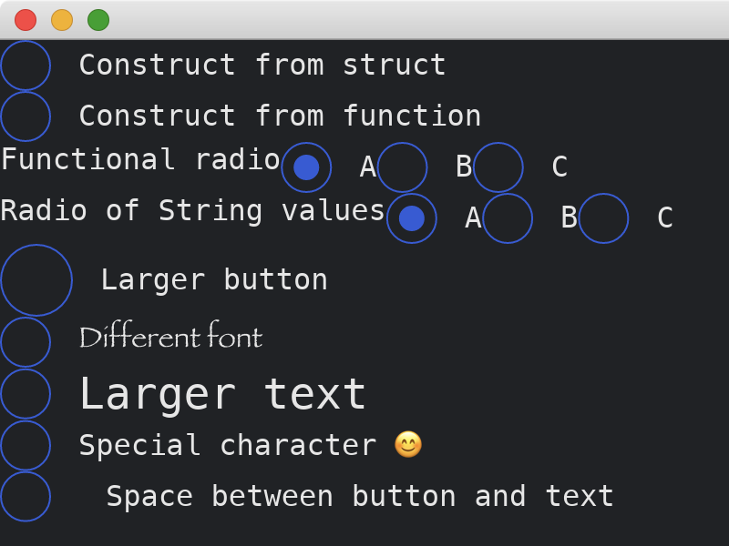

# Radio

The [Radio](https://docs.rs/iced/0.13.1/iced/widget/radio/struct.Radio.html) widget represents a choice among multiple values.
It has two methods of constructions: the `radio` function and the `Radio::new` constructor.
It supports reactions to clicking and touching, changing styles of the button and the text, and changing the space between them.

```rust
use iced::{
    Font,
    font::Family,
    widget::{Radio, column, radio, row, text, text::Shaping},
};

fn main() -> iced::Result {
    iced::run("My App", MyApp::update, MyApp::view)
}

#[derive(Debug, Clone)]
enum Message {
    DoNothing,
    Update3(u32),
    Update4(String),
}

#[derive(Default)]
struct MyApp {
    radio3: Option<u32>,
    radio4: Option<String>,
}

impl MyApp {
    fn update(&mut self, message: Message) {
        match message {
            Message::DoNothing => {}
            Message::Update3(i) => self.radio3 = Some(i),
            Message::Update4(s) => self.radio4 = Some(s),
        }
    }

    fn view(&self) -> iced::Element<Message> {
        column![
            Radio::new("Construct from struct", 0, None, |_| { Message::DoNothing }),
            radio("Construct from function", 0, None, |_| {
                Message::DoNothing
            }),
            row![
                text("Functional radio"),
                radio("A", 1, self.radio3, |i| Message::Update3(i)),
                radio("B", 2, self.radio3, |i| Message::Update3(i)),
                radio("C", 3, self.radio3, |i| Message::Update3(i)),
            ],
            row![
                text("Radio of String values"),
                radio("A", &"a".to_string(), self.radio4.as_ref(), |s| {
                    Message::Update4(s.into())
                }),
                radio("B", &"b".to_string(), self.radio4.as_ref(), |s| {
                    Message::Update4(s.into())
                }),
                radio("C", &"c".to_string(), self.radio4.as_ref(), |s| {
                    Message::Update4(s.into())
                }),
            ],
            radio("Larger button", 0, None, |_| Message::DoNothing).size(40),
            radio("Different font", 0, None, |_| Message::DoNothing).font(Font {
                family: Family::Fantasy,
                ..Font::DEFAULT
            }),
            radio("Larger text", 0, None, |_| Message::DoNothing).text_size(24),
            radio("Special character 😊", 0, None, |_| {
                Message::DoNothing
            })
            .text_shaping(Shaping::Advanced),
            radio("Space between button and text", 0, None, |_| {
                Message::DoNothing
            })
            .spacing(30),
        ]
        .into()
    }
}
```



:arrow_right: Next: [PickList](./picklist.md)

:blue_book: Back: [Table of contents](./../README.md)
