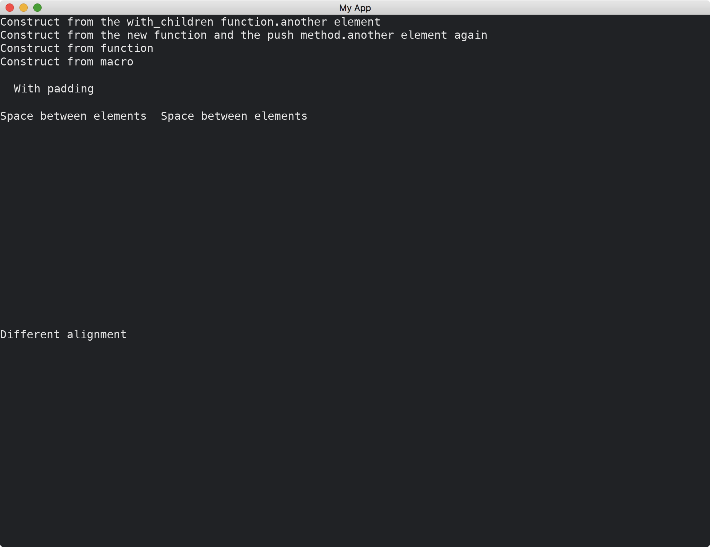

# Row

Similar to [Column](https://docs.rs/iced/latest/iced/widget/struct.Column.html), [Row](https://docs.rs/iced/latest/iced/widget/struct.Row.html) helps us placing widgets horizontally.
It can leave some space between its boundary and its inner content.
It can also add spaces among its inner widgets.
The inner widgets can be aligned top, middle or bottom.

```rust
use iced::{
    widget::{column, row, Row},
    Alignment, Length, Sandbox, Settings,
};

fn main() -> iced::Result {
    MyApp::run(Settings::default())
}

struct MyApp;

impl Sandbox for MyApp {
    type Message = ();

    fn new() -> Self {
        Self
    }

    fn title(&self) -> String {
        String::from("My App")
    }

    fn update(&mut self, _message: Self::Message) {}

    fn view(&self) -> iced::Element<'_, Self::Message> {
        column![
            Row::with_children(vec![
                "Construct from the with_children function.".into(),
                "another element".into(),
            ]),
            Row::new()
                .push("Construct from the new function and the push method.")
                .push("another element again"),
            row(vec!["Construct from function".into()]),
            row!["Construct from macro"],
            row!["With padding"].padding(20),
            row!["Space between elements", "Space between elements",].spacing(20),
            row!["Different alignment"]
                .height(Length::Fill)
                .align_items(Alignment::Center),
        ]
        .into()
    }
}
```



:arrow_right:  Next: [Changing Themes](./changing_themes.md)

:blue_book: Back: [Table of contents](./../README.md)
