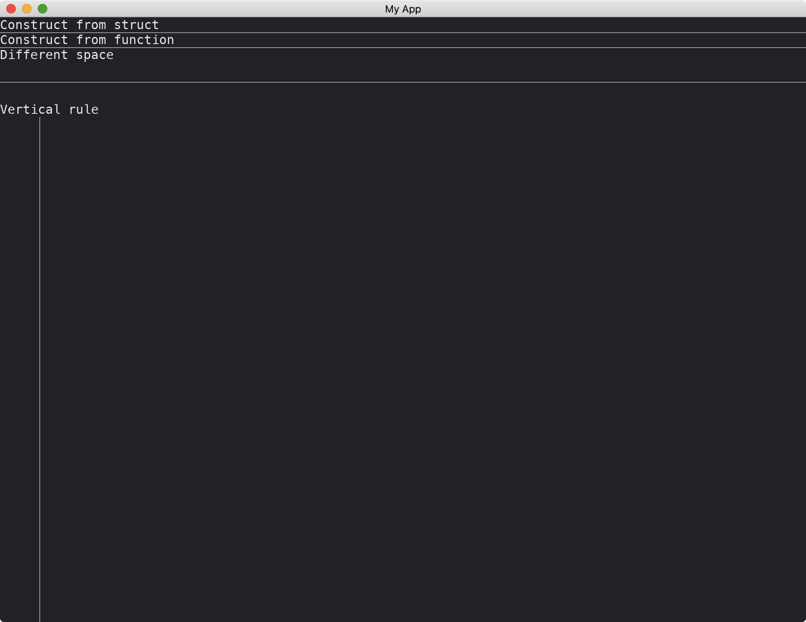

# Rule

The [Rule](https://docs.rs/iced/0.12.1/iced/widget/rule/struct.Rule.html) widget is a horizontal (or vertical) line for separating widgets clearly.
It has two methods of constructions.
We can change the space around it.
The widget can be set to be either horizontal or vertical.

```rust
use iced::{
    widget::{column, horizontal_rule, text, vertical_rule, Rule},
    Sandbox, Settings,
};

fn main() -> iced::Result {
    MyApp::run(Settings::default())
}

struct MyApp;

impl Sandbox for MyApp {
    type Message = ();

    fn new() -> Self {
        Self
    }

    fn title(&self) -> String {
        String::from("My App")
    }

    fn update(&mut self, _message: Self::Message) {}

    fn view(&self) -> iced::Element<'_, Self::Message> {
        column![
            text("Construct from struct"),
            Rule::horizontal(0),
            text("Construct from function"),
            horizontal_rule(0),
            text("Different space"),
            horizontal_rule(50),
            text("Vertical rule"),
            vertical_rule(100),
        ]
        .into()
    }
}
```



:arrow_right:  Next: [Image](./image.md)

:blue_book: Back: [Table of contents](./../README.md)
