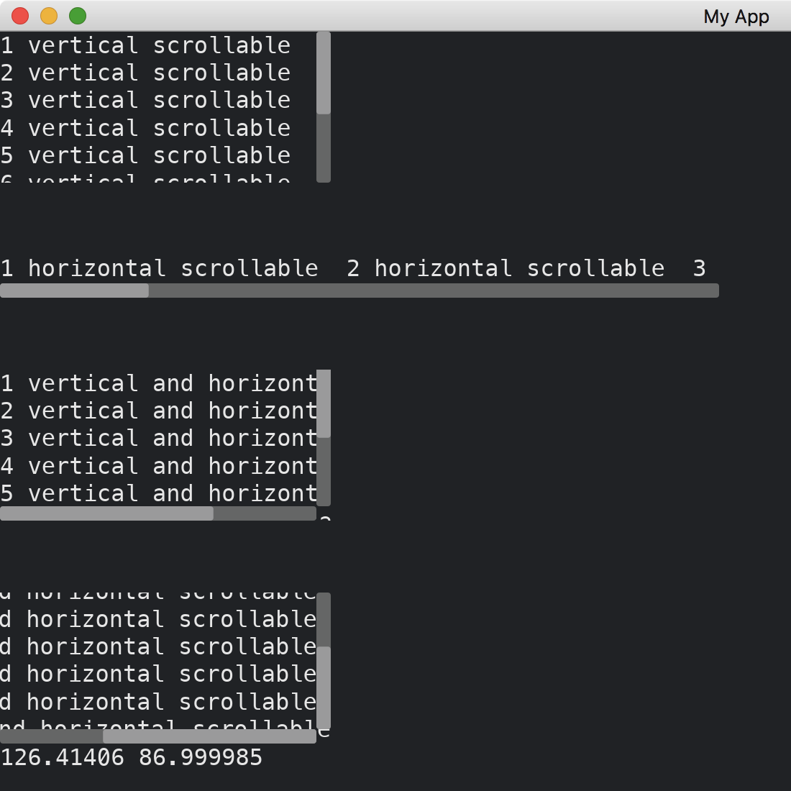

# Scrollable

When there are too many widgets, they may go beyond the boundary of the window.
[Scrollable](https://docs.rs/iced/0.13.1/iced/widget/scrollable/struct.Scrollable.html) provides an infinite space that widgets can be navigated by scroll bars. A scrollbar has two methods of construction: the `scrollbar` function and the `Scrollbar::new` constructor.
The scroll bars can be vertical, horizontal or both.
When the scroll bars are changed, we can also receive their scroll positions and update other widgets.

```rust
use iced::widget::{
    Scrollable, column, row,
    scrollable::{Direction, Scrollbar, Viewport},
    text,
};

fn main() -> iced::Result {
    iced::run("My App", MyApp::update, MyApp::view)
}

#[derive(Debug, Clone)]
enum Message {
    Scrolled4(Viewport),
}

#[derive(Default)]
struct MyApp {
    offset4: String,
}

impl MyApp {
    fn update(&mut self, message: Message) {
        match message {
            Message::Scrolled4(v) => {
                self.offset4 = format!("{} {}", v.absolute_offset().x, v.absolute_offset().y)
            }
        }
    }

    fn view(&self) -> iced::Element<Message> {
        let long_vertical_texts =
            column((0..10).map(|i| text(format!("{} vertical scrollable", i + 1)).into()));
        let long_horizontal_texts =
            row((0..10).map(|i| text(format!("{} horizontal scrollable  ", i + 1)).into()));
        let long_both_texts = column(
            (0..10).map(|i| text(format!("{} vertical and horizontal scrollable", i + 1)).into()),
        );
        let long_both_texts_2 = column(
            (0..10).map(|i| text(format!("{} vertical and horizontal scrollable", i + 1)).into()),
        );

        column![
            Scrollable::new(long_vertical_texts)
                .width(230)
                .height(105)
                .direction(Direction::Vertical(Scrollbar::new())),
            Scrollable::new(long_horizontal_texts)
                .width(500)
                .height(30)
                .direction(Direction::Horizontal(Scrollbar::new())),
            Scrollable::new(long_both_texts)
                .width(230)
                .height(105)
                .direction(Direction::Both {
                    vertical: Scrollbar::new(),
                    horizontal: Scrollbar::new()
                }),
            column![
                Scrollable::new(long_both_texts_2)
                    .width(230)
                    .height(105)
                    .direction(Direction::Both {
                        vertical: Scrollbar::new(),
                        horizontal: Scrollbar::new()
                    })
                    .on_scroll(Message::Scrolled4),
                text(&self.offset4),
            ],
        ]
        .spacing(50)
        .into()
    }
}
```



:arrow_right: Next: [Styles](./styles.md)

:blue_book: Back: [Table of contents](./../README.md)
