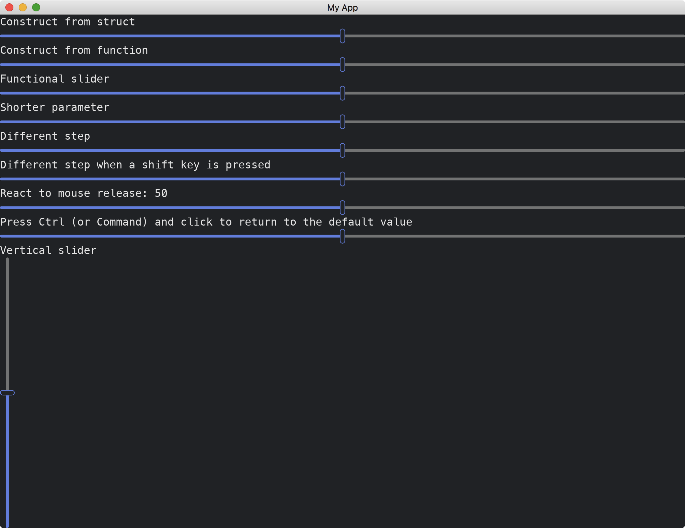

# Slider And VerticalSlider

The [Slider](https://docs.iced.rs/iced/widget/slider/struct.Slider.html) widget represents a chosen value in a given range.
It has two methods of constructions.
It supports reactions to mouse pressing/releasing and touching.
The selected value can be snapped to a given step.
The widget can be set to be either horizontal or vertical.

```rust
use iced::{
    widget::{column, slider, text, vertical_slider, Slider},
    Sandbox, Settings,
};

fn main() -> iced::Result {
    MyApp::run(Settings::default())
}

#[derive(Debug, Clone)]
enum MyAppMessage {
    DoNothing,
    Update3(u32),
    Update4(u32),
    Update5(u32),
    Update6(u32),
    Release6,
}

struct MyApp {
    value3: u32,
    value4: u32,
    value5: u32,
    value6: u32,
    released_value_6: u32,
}

impl Sandbox for MyApp {
    type Message = MyAppMessage;

    fn new() -> Self {
        Self {
            value3: 50,
            value4: 50,
            value5: 50,
            value6: 50,
            released_value_6: 50,
        }
    }

    fn title(&self) -> String {
        String::from("My App")
    }

    fn update(&mut self, message: Self::Message) {
        match message {
            MyAppMessage::DoNothing => {}
            MyAppMessage::Update3(v) => self.value3 = v,
            MyAppMessage::Update4(v) => self.value4 = v,
            MyAppMessage::Update5(v) => self.value5 = v,
            MyAppMessage::Update6(v) => self.value6 = v,
            MyAppMessage::Release6 => self.released_value_6 = self.value6,
        }
    }

    fn view(&self) -> iced::Element<'_, Self::Message> {
        column![
            text("Construct from struct"),
            Slider::new(0..=100, 50, |_| MyAppMessage::DoNothing),
            text("Construct from function"),
            slider(0..=100, 50, |_| MyAppMessage::DoNothing),
            text("Functional slider"),
            slider(0..=100, self.value3, |v| MyAppMessage::Update3(v)),
            text("Shorter parameter"),
            slider(0..=100, self.value4, MyAppMessage::Update4),
            text("Different step"),
            slider(0..=100, self.value5, MyAppMessage::Update5).step(10),
            text(format!("React to mouse release: {}", self.released_value_6)),
            slider(0..=100, self.value6, MyAppMessage::Update6).on_release(MyAppMessage::Release6),
            text("Vertical slider"),
            vertical_slider(0..=100, 50, |_| MyAppMessage::DoNothing),
        ]
        .into()
    }
}
```



:arrow_right:  Next: [Changing Themes](./changing_themes.md)
