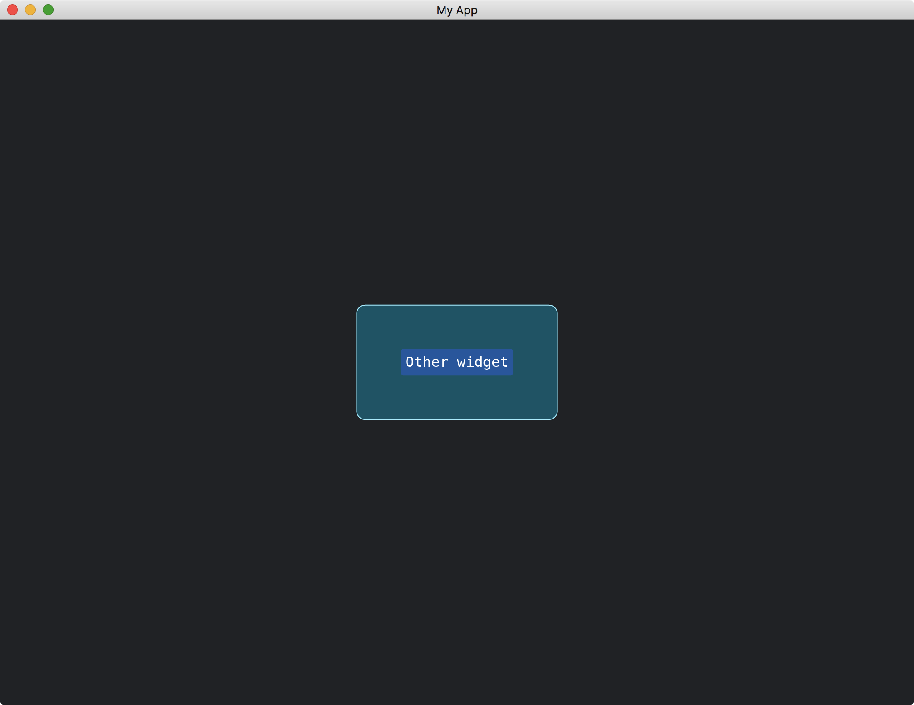

# Taking Any Children

Since all [Widget](https://docs.rs/iced/latest/iced/advanced/widget/trait.Widget.html) can be transformed to [Element](https://docs.rs/iced_core/0.12.1/iced_core/struct.Element.html), our custom widget is able to take any [Widget](https://docs.rs/iced/latest/iced/advanced/widget/trait.Widget.html) as its children.

This time, our `MyWidgetOuter` will take an [Element](https://docs.rs/iced_core/0.12.1/iced_core/struct.Element.html) as its inner widget when it is initialized.

```rust
struct MyWidgetOuter<'a, Message, Renderer> {
    inner_widget: Element<'a, Message, Renderer>,
}

impl<'a, Message, Renderer> MyWidgetOuter<'a, Message, Renderer>
where
    Renderer: iced::advanced::Renderer,
{
    fn new(inner_widget: Element<'a, Message, Renderer>) -> Self {
        Self { inner_widget }
    }
}
```

When we draw or layout the `inner_widget`, we will use its methods from [Widget](https://docs.rs/iced/latest/iced/advanced/widget/trait.Widget.html).
Yet, the `inner_widget` is of type [Element](https://docs.rs/iced_core/0.12.1/iced_core/struct.Element.html).
So, we have to cast it as [Widget](https://docs.rs/iced/latest/iced/advanced/widget/trait.Widget.html) by the [as_widget](https://docs.rs/iced_core/0.12.1/iced_core/struct.Element.html#method.as_widget) method.

```rust
fn layout(&self, renderer: &Renderer, limits: &layout::Limits) -> layout::Node {
    let mut child_node = self.inner_widget.as_widget().layout(renderer, limits);

    let size_of_this_node = child_node.size().pad(50.into());

    child_node.align(Alignment::Center, Alignment::Center, size_of_this_node);

    layout::Node::with_children(size_of_this_node, vec![child_node])
}
```

In the code above, we make the size of `MyWidgetOuter` relative to its `inner_widget`.
More precisely, we retrieve the size of `inner_widget` and [pad](https://docs.rs/iced_core/0.10.0/iced_core/struct.Size.html#method.pad) the size as the size of `MyWidgetOuter`.

Then, in the [draw](https://docs.rs/iced/latest/iced/advanced/widget/trait.Widget.html#tymethod.draw) method of `MyWidgetOuter`, we also draw the `inner_widget`.

```rust
fn draw(
    &self,
    state: &Tree,
    renderer: &mut Renderer,
    theme: &Renderer::Theme,
    style: &renderer::Style,
    layout: Layout<'_>,
    cursor: mouse::Cursor,
    viewport: &Rectangle,
) {
    renderer.fill_quad(
        Quad {
            bounds: layout.bounds(),
            border_radius: 10.0.into(),
            border_width: 1.0,
            border_color: Color::from_rgb(0.6, 0.93, 1.0),
        },
        Color::from_rgb(0.0, 0.33, 0.4),
    );

    self.inner_widget.as_widget().draw(
        &state.children[0],
        renderer,
        theme,
        style,
        layout.children().next().unwrap(),
        cursor,
        viewport,
    );
}
```

Note that we have to pass the child state `&state.children[0]` to `inner_widget` since the anonymous widget may need the information about its state.

To make the underlying system aware of the child state, we have to explicitly tell the system the existence of the child.
Otherwise, `state.children` in [draw](https://docs.rs/iced/latest/iced/advanced/widget/trait.Widget.html#tymethod.draw) will be empty.

```rust
fn children(&self) -> Vec<Tree> {
    vec![Tree::new(self.inner_widget.as_widget())]
}
```

The full code is as follows:

```rust
use iced::{
    advanced::{
        layout, mouse,
        renderer::{self, Quad},
        widget::Tree,
        Layout, Widget,
    },
    widget::{button, container},
    Alignment, Color, Element, Length, Rectangle, Sandbox, Settings,
};

fn main() -> iced::Result {
    MyApp::run(Settings::default())
}

struct MyApp;

impl Sandbox for MyApp {
    type Message = ();

    fn new() -> Self {
        Self
    }

    fn title(&self) -> String {
        String::from("My App")
    }

    fn update(&mut self, _message: Self::Message) {}

    fn view(&self) -> iced::Element<'_, Self::Message> {
        container(MyWidgetOuter::new(button("Other widget").into()))
            .width(Length::Fill)
            .height(Length::Fill)
            .center_x()
            .center_y()
            .into()
    }
}

struct MyWidgetOuter<'a, Message, Renderer> {
    inner_widget: Element<'a, Message, Renderer>,
}

impl<'a, Message, Renderer> MyWidgetOuter<'a, Message, Renderer>
where
    Renderer: iced::advanced::Renderer,
{
    fn new(inner_widget: Element<'a, Message, Renderer>) -> Self {
        Self { inner_widget }
    }
}

impl<Message, Renderer> Widget<Message, Renderer> for MyWidgetOuter<'_, Message, Renderer>
where
    Renderer: iced::advanced::Renderer,
{
    fn width(&self) -> Length {
        Length::Shrink
    }

    fn height(&self) -> Length {
        Length::Shrink
    }

    fn layout(&self, renderer: &Renderer, limits: &layout::Limits) -> layout::Node {
        let mut child_node = self.inner_widget.as_widget().layout(renderer, limits);

        let size_of_this_node = child_node.size().pad(50.into());

        child_node.align(Alignment::Center, Alignment::Center, size_of_this_node);

        layout::Node::with_children(size_of_this_node, vec![child_node])
    }

    fn children(&self) -> Vec<Tree> {
        vec![Tree::new(self.inner_widget.as_widget())]
    }

    fn draw(
        &self,
        state: &Tree,
        renderer: &mut Renderer,
        theme: &Renderer::Theme,
        style: &renderer::Style,
        layout: Layout<'_>,
        cursor: mouse::Cursor,
        viewport: &Rectangle,
    ) {
        renderer.fill_quad(
            Quad {
                bounds: layout.bounds(),
                border_radius: 10.0.into(),
                border_width: 1.0,
                border_color: Color::from_rgb(0.6, 0.93, 1.0),
            },
            Color::from_rgb(0.0, 0.33, 0.4),
        );

        self.inner_widget.as_widget().draw(
            &state.children[0],
            renderer,
            theme,
            style,
            layout.children().next().unwrap(),
            cursor,
            viewport,
        );
    }
}

impl<'a, Message, Renderer> From<MyWidgetOuter<'a, Message, Renderer>>
    for Element<'a, Message, Renderer>
where
    Message: 'a,
    Renderer: iced::advanced::Renderer + 'a,
{
    fn from(widget: MyWidgetOuter<'a, Message, Renderer>) -> Self {
        Self::new(widget)
    }
}
```



:arrow_right:  Next: [Loading Images Asynchronously](./loading_images_asynchronously.md)

:blue_book: Back: [Table of contents](./../README.md)
