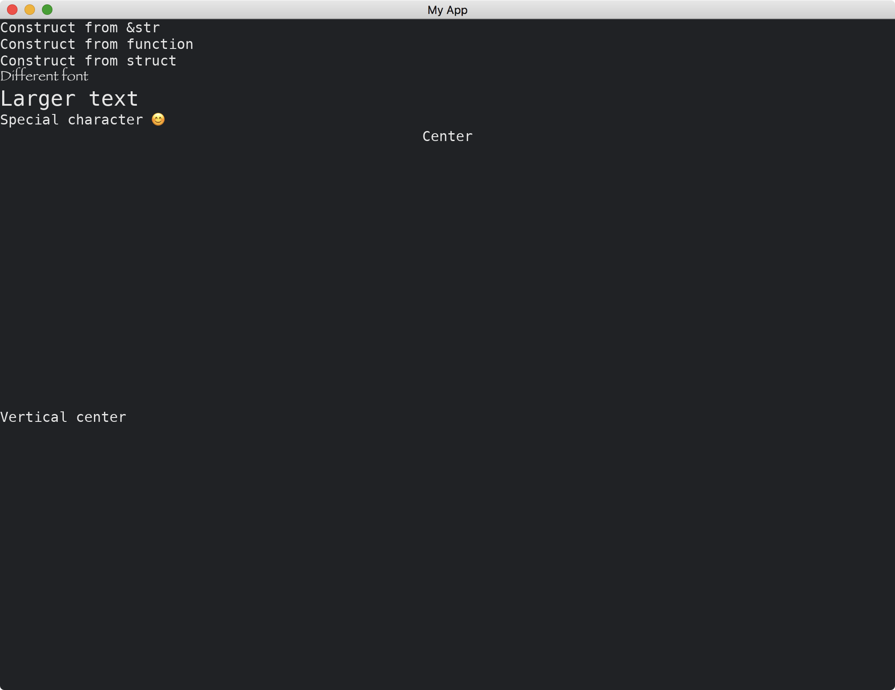

# Text

The [Text](https://docs.iced.rs/iced/widget/type.Text.html) widget is able to display texts.
It has three methods of constructions.
It is able to change the font, the size of the font, and display special characters.
The text inside the widget can be horizontally or vertically centered.

```rust
use iced::{
    alignment::{Horizontal, Vertical},
    font::Family,
    widget::{column, text, text::Shaping, Text},
    Font, Length, Sandbox, Settings,
};

fn main() -> iced::Result {
    MyApp::run(Settings::default())
}

struct MyApp;

impl Sandbox for MyApp {
    type Message = ();

    fn new() -> Self {
        Self
    }

    fn title(&self) -> String {
        String::from("My App")
    }

    fn update(&mut self, _message: Self::Message) {}

    fn view(&self) -> iced::Element<'_, Self::Message> {
        column![
            "Construct from &str",
            text("Construct from function"),
            Text::new("Construct from struct"),
            text("Different font").font(Font {
                family: Family::Fantasy,
                ..Font::DEFAULT
            }),
            text("Larger text").size(24),
            text("Special character 😊").shaping(Shaping::Advanced),
            text("Center")
                .width(Length::Fill)
                .horizontal_alignment(Horizontal::Center),
            text("Vertical center")
                .height(Length::Fill)
                .vertical_alignment(Vertical::Center),
        ]
        .into()
    }
}
```



:arrow_right:  Next: [Button](./button.md)

:blue_book: Back: [Table of contents](./../README.md)
