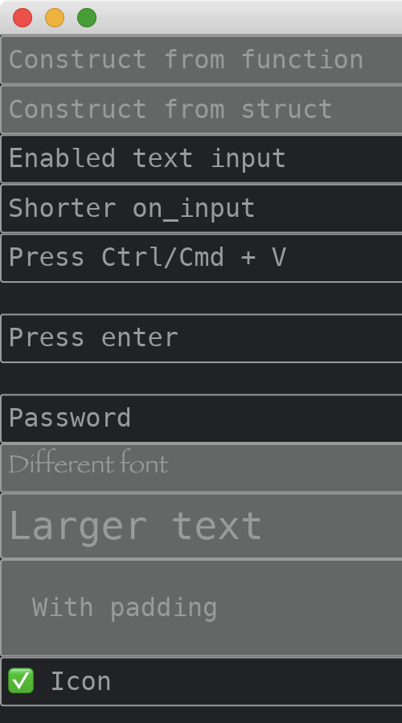

# TextInput

The [TextInput](https://docs.rs/iced/0.12.1/iced/latest/iced/widget/struct.TextInput.html) widget let users to input texts.
It has two methods of constructions.
If the [on_input](https://docs.rs/iced/0.12.1/iced/widget/struct.TextInput.html#method.on_input) method is set, it is enabled, and is disabled otherwise.
It supports reactions to pasting texts or keyboard submissions.
It is able to change fonts and text sizes.
We can add padding around the text inside.
We can also add an optional icon.

```rust
use iced::{
    font::Family,
    widget::{
        column, text, text_input,
        text_input::{Icon, Side},
        TextInput,
    },
    Font, Sandbox, Settings,
};

fn main() -> iced::Result {
    MyApp::run(Settings::default())
}

#[derive(Debug, Clone)]
enum MyAppMessage {
    Update3(String),
    Update4(String),
    Update5(String),
    Paste5(String),
    Update6(String),
    Submit6,
    Update7(String),
    Update11(String),
}

#[derive(Default)]
struct MyApp {
    text3: String,
    text4: String,
    text5: String,
    info5: String,
    text6: String,
    info6: String,
    text7: String,
    text11: String,
}

impl Sandbox for MyApp {
    type Message = MyAppMessage;

    fn new() -> Self {
        Self::default()
    }

    fn title(&self) -> String {
        String::from("My App")
    }

    fn update(&mut self, message: Self::Message) {
        match message {
            MyAppMessage::Update3(s) => self.text3 = s,
            MyAppMessage::Update4(s) => self.text4 = s,
            MyAppMessage::Update5(s) => {
                self.text5 = s;
                self.info5 = "".into();
            }
            MyAppMessage::Paste5(s) => {
                self.text5 = s;
                self.info5 = "Pasted".into();
            }
            MyAppMessage::Update6(s) => {
                self.text6 = s;
                self.info6 = "".into();
            }
            MyAppMessage::Submit6 => self.info6 = "Submitted".into(),
            MyAppMessage::Update7(s) => self.text7 = s,
            MyAppMessage::Update11(s) => self.text11 = s,
        }
    }

    fn view(&self) -> iced::Element<'_, Self::Message> {
        column![
            text_input("Construct from function", ""),
            TextInput::new("Construct from struct", ""),
            text_input("Enabled text input", self.text3.as_str())
                .on_input(|s| MyAppMessage::Update3(s)),
            text_input("Shorter on_input", self.text4.as_str()).on_input(MyAppMessage::Update4),
            text_input("Press Ctrl/Cmd + V", self.text5.as_str())
                .on_input(MyAppMessage::Update5)
                .on_paste(MyAppMessage::Paste5),
            text(self.info5.as_str()),
            text_input("Press enter", self.text6.as_str())
                .on_input(MyAppMessage::Update6)
                .on_submit(MyAppMessage::Submit6),
            text(self.info6.as_str()),
            text_input("Password", self.text7.as_str())
                .secure(true)
                .on_input(MyAppMessage::Update7),
            text_input("Different font", "").font(Font {
                family: Family::Fantasy,
                ..Font::DEFAULT
            }),
            text_input("Larger text", "").size(24),
            text_input("With padding", "").padding(20),
            text_input("Icon", self.text11.as_str())
                .icon(Icon {
                    font: Font::DEFAULT,
                    code_point: '\u{2705}',
                    size: None,
                    spacing: 10.,
                    side: Side::Left,
                })
                .on_input(MyAppMessage::Update11),
        ]
        .into()
    }
}
```



:arrow_right:  Next: [Checkbox](./checkbox.md)

:blue_book: Back: [Table of contents](./../README.md)
