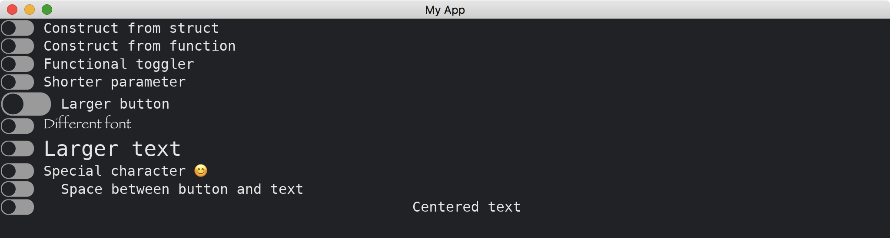

# Toggler

The [Toggler](https://docs.rs/iced/0.12.1/iced/widget/toggler/struct.Toggler.html) widget represents a boolean value.
(Note, it appears on the right of its text.)
It has two methods of constructions.
It supports reactions to clicking and touching.
It is able to change styles of the button and the text.
It can also align its text.

```rust
use iced::{
    Sandbox, Settings, widget::{column, Toggler, toggler, text::Shaping}, Font, font::Family, alignment::Horizontal,
};

fn main() -> iced::Result {
    MyApp::run(Settings::default())
}

#[derive(Debug, Clone)]
enum MyAppMessage {
    DoNothing,
    Update3(bool),
    Update4(bool),
}

#[derive(Default)]
struct MyApp {
    toggler3: bool,
    toggler4: bool,
}

impl Sandbox for MyApp {
    type Message = MyAppMessage;

    fn new() -> Self {
        Self {
            ..Default::default()
        }
    }

    fn title(&self) -> String {
        String::from("My App")
    }

    fn update(&mut self, message: Self::Message) {
        match message {
            MyAppMessage::DoNothing => {}
            MyAppMessage::Update3(b) => self.toggler3 = b,
            MyAppMessage::Update4(b) => self.toggler4 = b,
        }
    }

    fn view(&self) -> iced::Element<'_, Self::Message> {
        column![
            Toggler::new(Some("Construct from struct".into()), false, |_| MyAppMessage::DoNothing),
            toggler(Some("Construct from function".into()), false, |_| MyAppMessage::DoNothing),
            toggler(Some("Functional toggler".into()), self.toggler3, |b| MyAppMessage::Update3(b)),
            toggler(Some("Shorter parameter".into()), self.toggler4, MyAppMessage::Update4),
            toggler(Some("Larger button".into()), false, |_| MyAppMessage::DoNothing).size(30),
            toggler(Some("Different font".into()), false, |_| MyAppMessage::DoNothing).font(Font {
                family: Family::Fantasy,
                ..Font::DEFAULT
            }),
            toggler(Some("Larger text".into()), false, |_| MyAppMessage::DoNothing).text_size(24),
            toggler(Some("Special character 😊".into()), false, |_| MyAppMessage::DoNothing).text_shaping(Shaping::Advanced),
            toggler(Some("Centered text".into()), false, |_| MyAppMessage::DoNothing).text_alignment(Horizontal::Center),
        ]
        .into()
    }
}
```



:arrow_right:  Next: [Radio](./radio.md)

:blue_book: Back: [Table of contents](./../README.md)
