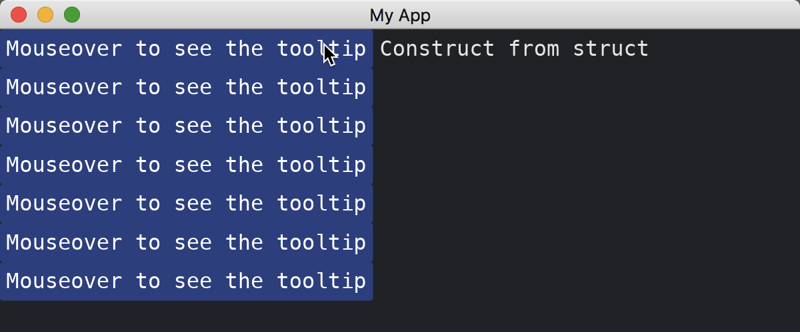

# Tooltip

The [Tooltip](https://docs.rs/iced/0.13.1/iced/widget/tooltip/struct.Tooltip.html) widget displays a text when the mouse is over a specified widget.
It has two methods of construction: the `tooltip` function and the `Tooltip::new` constructor.
It is able to change styles of the text, add padding around the text inside, and change the space between the tooltip and the target widget.
If the tooltip is allowed to be out of the window, the parts outside are clipped.

```rust
use iced::widget::{Tooltip, button, column, tooltip, tooltip::Position};

fn main() -> iced::Result {
    iced::run("My App", MyApp::update, MyApp::view)
}

#[derive(Debug, Clone)]
enum Message {}

#[derive(Default)]
struct MyApp;

impl MyApp {
    fn update(&mut self, _message: Message) {}

    fn view(&self) -> iced::Element<Message> {
        column![
            Tooltip::new(
                button("Mouseover to see the tooltip"),
                "Construct from struct",
                Position::Right
            ),
            tooltip(
                button("Mouseover to see the tooltip"),
                "Construct from function",
                Position::Right
            ),
            tooltip(
                button("Mouseover to see the tooltip"),
                "With padding",
                Position::Right
            )
            .padding(20),
            tooltip(
                button("Mouseover to see the tooltip"),
                "Far away from the widget",
                Position::Right
            )
            .gap(50),
            tooltip(
                button("Mouseover to see the tooltip"),
                "Parts out of the window are clipped",
                Position::Right
            )
            .snap_within_viewport(false),
            tooltip(
                button("Mouseover to see the tooltip"),
                "Follow the cursor",
                Position::FollowCursor
            )
        ]
        .into()
    }
}
```



:arrow_right: Next: [Rule](./rule.md)

:blue_book: Back: [Table of contents](./../README.md)
