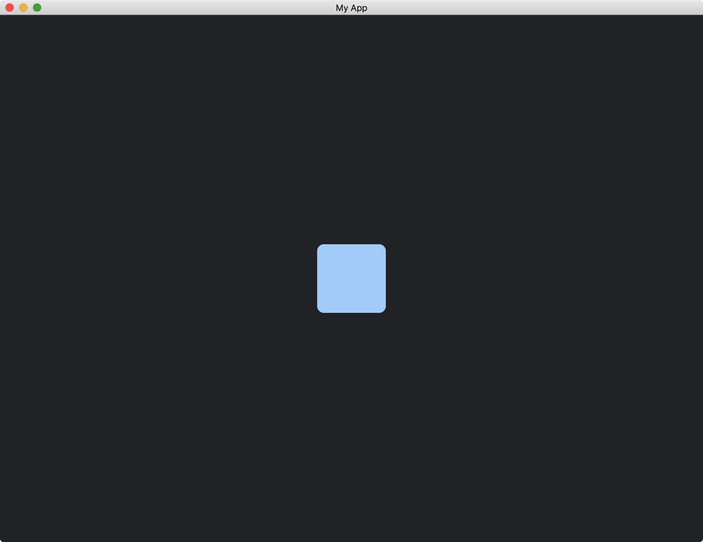

# Updating Widgets From Events

Sometimes, we would like our widgets to handle their states by themselves.
For example, a widget might change its states when receiving an [Event](https://docs.rs/iced/0.12.1/iced/event/enum.Event.html).

To do so, we implement the [on_event](https://docs.rs/iced/0.12.1/iced/advanced/widget/trait.Widget.html#method.on_event) method of [Widget](https://docs.rs/iced/0.12.1/iced/advanced/widget/trait.Widget.html).

```rust
fn on_event(
    &mut self,
    _state: &mut Tree,
    event: Event,
    _layout: Layout<'_>,
    _cursor: mouse::Cursor,
    _renderer: &Renderer,
    _clipboard: &mut dyn Clipboard,
    _shell: &mut Shell<'_, Message>,
    _viewport: &Rectangle,
) -> event::Status {
    match event {
		Event::Keyboard(keyboard::Event::KeyPressed {
			key: keyboard::Key::Named(Named::Space),
            ..
        }) => {
            self.highlight = !self.highlight;
            event::Status::Captured
        }
        _ => event::Status::Ignored,
    }
}
```

Our widget changes its `highlight` field every time when the space bar is pressed.

If the [Event](https://docs.rs/iced/0.12.1/iced/event/enum.Event.html) passed to the [on_event](https://docs.rs/iced/0.12.1/iced/advanced/widget/trait.Widget.html#method.on_event) method is what the widget needs, we return [Status::Captured](https://docs.rs/iced/0.12.1/iced/event/enum.Status.html#variant.Captured).
Otherwise, we return [Status::Ignored](https://docs.rs/iced/0.12.1/iced/event/enum.Status.html#variant.Ignored) to tell the system the event can be used by other widgets.

Since our widget maintains its own state, we do not need to pass the state from our app.

```rust
struct MyWidget {
    highlight: bool,
}

impl MyWidget {
    fn new() -> Self {
        Self { highlight: false }
    }
}
```

The full code is as follows:

```rust
use iced::{
    advanced::{
        graphics::core::event,
        layout, mouse,
        renderer::{self, Quad},
        widget::Tree,
        Clipboard, Layout, Shell, Widget,
    },
    keyboard::{self, key::Named},
    widget::container,
    Border, Color, Element, Event, Length, Rectangle, Sandbox, Settings, Shadow, Size, Theme,
};

fn main() -> iced::Result {
    MyApp::run(Settings::default())
}

struct MyApp;

impl Sandbox for MyApp {
    type Message = ();

    fn new() -> Self {
        Self
    }

    fn title(&self) -> String {
        String::from("My App")
    }

    fn update(&mut self, _message: Self::Message) {}

    fn view(&self) -> iced::Element<'_, Self::Message> {
        container(MyWidget::new())
            .width(Length::Fill)
            .height(Length::Fill)
            .center_x()
            .center_y()
            .into()
    }
}

struct MyWidget {
    highlight: bool,
}

impl MyWidget {
    fn new() -> Self {
        Self { highlight: false }
    }
}

impl<Message, Renderer> Widget<Message, Theme, Renderer> for MyWidget
where
    Renderer: iced::advanced::Renderer,
{
    fn size(&self) -> Size<Length> {
        Size {
            width: Length::Shrink,
            height: Length::Shrink,
        }
    }

    fn layout(
        &self,
        _tree: &mut Tree,
        _renderer: &Renderer,
        _limits: &layout::Limits,
    ) -> layout::Node {
        layout::Node::new([100, 100].into())
    }

    fn draw(
        &self,
        _state: &Tree,
        renderer: &mut Renderer,
        _theme: &Theme,
        _style: &renderer::Style,
        layout: Layout<'_>,
        _cursor: mouse::Cursor,
        _viewport: &Rectangle,
    ) {
        renderer.fill_quad(
            Quad {
                bounds: layout.bounds(),
                border: Border {
                    color: Color::from_rgb(0.6, 0.8, 1.0),
                    width: 1.0,
                    radius: 10.0.into(),
                },
                shadow: Shadow::default(),
            },
            if self.highlight {
                Color::from_rgb(0.6, 0.8, 1.0)
            } else {
                Color::from_rgb(0.0, 0.2, 0.4)
            },
        );
    }

    fn on_event(
        &mut self,
        _state: &mut Tree,
        event: Event,
        _layout: Layout<'_>,
        _cursor: mouse::Cursor,
        _renderer: &Renderer,
        _clipboard: &mut dyn Clipboard,
        _shell: &mut Shell<'_, Message>,
        _viewport: &Rectangle,
    ) -> event::Status {
        match event {
            Event::Keyboard(keyboard::Event::KeyPressed {
                key: keyboard::Key::Named(Named::Space),
                ..
            }) => {
                self.highlight = !self.highlight;
                event::Status::Captured
            }
            _ => event::Status::Ignored,
        }
    }
}

impl<'a, Message, Renderer> From<MyWidget> for Element<'a, Message, Theme, Renderer>
where
    Renderer: iced::advanced::Renderer,
{
    fn from(widget: MyWidget) -> Self {
        Self::new(widget)
    }
}
```

When the space bar is pressed, the widget color switches between light and dark.




:arrow_right:  Next: [Producing Widget Messages](./producing_widget_messages.md)

:blue_book: Back: [Table of contents](./../README.md)
