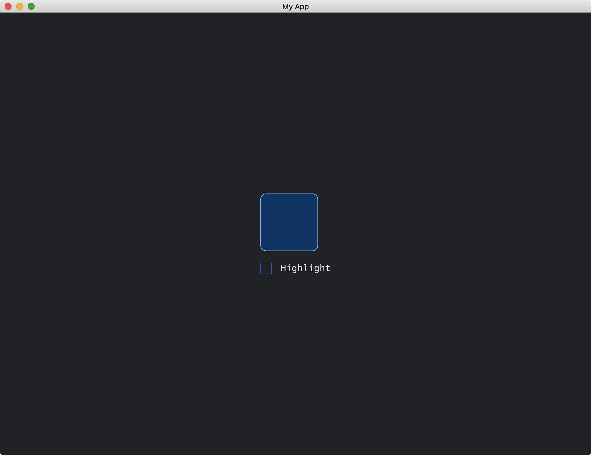
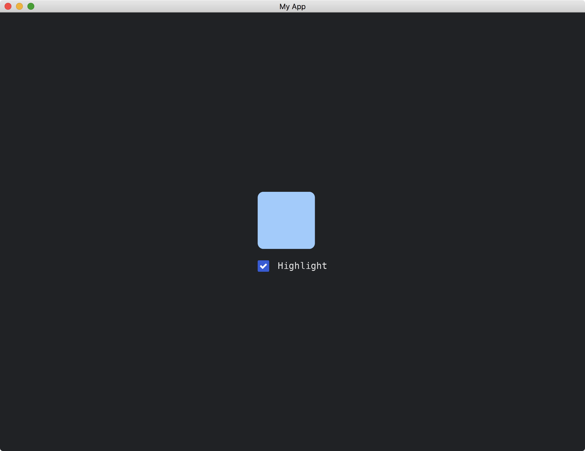

# Updating Widgets From Outside

Consider that our widget has an internal state:

```rust
struct MyWidget {
    highlight: bool,
}
```

We use the `highlight` variable to change the color of our widget in the [draw](https://docs.rs/iced/latest/iced/advanced/widget/trait.Widget.html#tymethod.draw) method.

```rust
fn draw(
    &self,
    _state: &Tree,
    renderer: &mut Renderer,
    _theme: &Renderer::Theme,
    _style: &renderer::Style,
    layout: Layout<'_>,
    _cursor: mouse::Cursor,
    _viewport: &Rectangle,
) {
    renderer.fill_quad(
        Quad {
            bounds: layout.bounds(),
            border_radius: 10.0.into(),
            border_width: 1.0,
            border_color: Color::from_rgb(0.6, 0.8, 1.0),
        },
        if self.highlight {
            Color::from_rgb(0.6, 0.8, 1.0)
        } else {
            Color::from_rgb(0.0, 0.2, 0.4)
        },
    );
}
```

We would like to control the `highlight` variable from our app.

To do so, we make `MyWidget` to accept the `highlight` variable when the widget is constructed.

```rust
impl MyWidget {
    fn new(highlight: bool) -> Self {
        Self { highlight }
    }
}
```

Then, we initialize `MyWidget` in the [view](https://docs.rs/iced/latest/iced/trait.Sandbox.html#tymethod.view) method of [Sandbox](https://docs.rs/iced/latest/iced/trait.Sandbox.html) with an input value for the `highlight` variable.

```rust
struct MyApp {
    highlight: bool,
}

impl Sandbox for MyApp {
    // ...
    fn view(&self) -> iced::Element<'_, Self::Message> {
        container(
            column![
                MyWidget::new(self.highlight),
                // ...
            ]
            // ...
        )
        // ...
    }
}
```

In this example, we control the `highlight` variable by a checkbox.

The full code is as follows:

```rust
use iced::{
    advanced::{
        layout, mouse,
        renderer::{self, Quad},
        widget::Tree,
        Layout, Widget,
    },
    widget::{checkbox, column, container},
    Color, Element, Length, Rectangle, Sandbox, Settings,
};

fn main() -> iced::Result {
    MyApp::run(Settings::default())
}

#[derive(Debug, Clone)]
enum MyMessage {
    Highlight(bool),
}

struct MyApp {
    highlight: bool,
}

impl Sandbox for MyApp {
    type Message = MyMessage;

    fn new() -> Self {
        Self { highlight: false }
    }

    fn title(&self) -> String {
        String::from("My App")
    }

    fn update(&mut self, message: Self::Message) {
        match message {
            MyMessage::Highlight(h) => self.highlight = h,
        }
    }

    fn view(&self) -> iced::Element<'_, Self::Message> {
        container(
            column![
                MyWidget::new(self.highlight),
                checkbox("Highlight", self.highlight, MyMessage::Highlight),
            ]
            .spacing(20),
        )
        .width(Length::Fill)
        .height(Length::Fill)
        .center_x()
        .center_y()
        .into()
    }
}

struct MyWidget {
    highlight: bool,
}

impl MyWidget {
    fn new(highlight: bool) -> Self {
        Self { highlight }
    }
}

impl<Message, Renderer> Widget<Message, Renderer> for MyWidget
where
    Renderer: iced::advanced::Renderer,
{
    fn width(&self) -> Length {
        Length::Shrink
    }

    fn height(&self) -> Length {
        Length::Shrink
    }

    fn layout(&self, _renderer: &Renderer, _limits: &layout::Limits) -> layout::Node {
        layout::Node::new([100, 100].into())
    }

    fn draw(
        &self,
        _state: &Tree,
        renderer: &mut Renderer,
        _theme: &Renderer::Theme,
        _style: &renderer::Style,
        layout: Layout<'_>,
        _cursor: mouse::Cursor,
        _viewport: &Rectangle,
    ) {
        renderer.fill_quad(
            Quad {
                bounds: layout.bounds(),
                border_radius: 10.0.into(),
                border_width: 1.0,
                border_color: Color::from_rgb(0.6, 0.8, 1.0),
            },
            if self.highlight {
                Color::from_rgb(0.6, 0.8, 1.0)
            } else {
                Color::from_rgb(0.0, 0.2, 0.4)
            },
        );
    }
}

impl<'a, Message, Renderer> From<MyWidget> for Element<'a, Message, Renderer>
where
    Renderer: iced::advanced::Renderer,
{
    fn from(widget: MyWidget) -> Self {
        Self::new(widget)
    }
}
```

When `highlight` is false:



When `highlight` is true:



<!-- :arrow_right:  Next:  -->

:blue_book: Back: [Table of contents](./../README.md)
