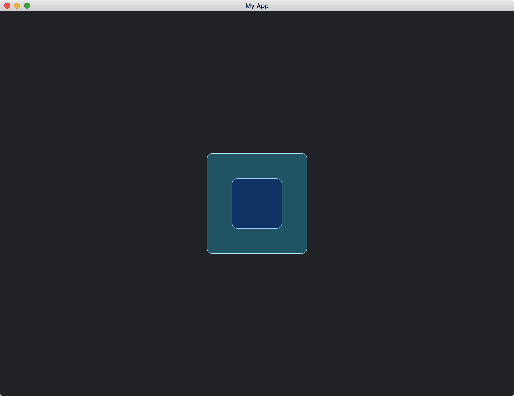

# Widgets With Children

A custom widget can contain another custom widget.

In the following example, we have a `MyWidgetOuter` that contains a `MyWidgetInner`.
The `MyWidgetInner`, which is the same as before, is a simple rectangle.

```rust
struct MyWidgetInner;

impl<Message, Renderer> Widget<Message, Renderer> for MyWidgetInner
where
    Renderer: iced::advanced::Renderer,
{
    // ...
}

impl<'a, Message, Renderer> From<MyWidgetInner> for Element<'a, Message, Renderer>
where
    Renderer: iced::advanced::Renderer,
{
    // ...
}
```

The `MyWidgetOuter` contains `MyWidgetInner`.

```rust
struct MyWidgetOuter {
    inner_widget: MyWidgetInner,
}

impl MyWidgetOuter {
    fn new() -> Self {
        Self {
            inner_widget: MyWidgetInner,
        }
    }
}
```

In the [draw](https://docs.rs/iced/latest/iced/advanced/widget/trait.Widget.html#tymethod.draw) method of `MyWidgetOuter`, we draw the `MyWidgetInner` as well.

```rust
fn draw(
    &self,
    state: &Tree,
    renderer: &mut Renderer,
    theme: &Renderer::Theme,
    style: &renderer::Style,
    layout: Layout<'_>,
    cursor: mouse::Cursor,
    viewport: &Rectangle,
) {
    renderer.fill_quad(
        Quad {
            bounds: layout.bounds(),
            border_radius: 10.0.into(),
            border_width: 1.0,
            border_color: Color::from_rgb(0.6, 0.93, 1.0),
        },
        Color::from_rgb(0.0, 0.33, 0.4),
    );

    let inner_widget = &self.inner_widget as &dyn Widget<Message, Renderer>;
    inner_widget.draw(
        state,
        renderer,
        theme,
        style,
        layout.children().next().unwrap(),
        cursor,
        viewport,
    );
}
```

When drawing the `MyWidgetInner` in `MyWidgetOuter`, we need to pass the layout of the `MyWidgetInner`.
This layout information can be obtained by `layout.children().next().unwrap()`.
[layout.children()](https://docs.rs/iced/latest/iced/advanced/struct.Layout.html#method.children) is an [Iterator](https://doc.rust-lang.org/nightly/core/iter/trait.Iterator.html) that stores all the child layouts of `MyWidgetOuter`.

To make the underlying system aware of the child layouts of `MyWidgetOuter`, we have to explicitly tell the system in the [layout](https://docs.rs/iced/latest/iced/advanced/widget/trait.Widget.html#tymethod.layout) method.
Otherwise, the [layout.children()](https://docs.rs/iced/latest/iced/advanced/struct.Layout.html#method.children) in the [draw](https://docs.rs/iced/latest/iced/advanced/widget/trait.Widget.html#tymethod.draw) method will be empty.

```rust
fn layout(&self, renderer: &Renderer, limits: &layout::Limits) -> layout::Node {
    let inner_widget = &self.inner_widget as &dyn Widget<Message, Renderer>;
    let mut child_node = inner_widget.layout(renderer, limits);

    let size_of_this_node = Size::new(200., 200.);

    child_node.align(Alignment::Center, Alignment::Center, size_of_this_node);
    
    layout::Node::with_children(size_of_this_node, vec![child_node])
}
```

We use the [Node::with_children](https://docs.rs/iced/latest/iced/advanced/layout/struct.Node.html#method.with_children) function to bind the parent layout and its child layouts.

The full code is as follows:

```rust
use iced::{
    advanced::{
        layout, mouse,
        renderer::{self, Quad},
        widget::Tree,
        Layout, Widget,
    },
    widget::container,
    Alignment, Color, Element, Length, Rectangle, Sandbox, Settings, Size,
};

fn main() -> iced::Result {
    MyApp::run(Settings::default())
}

struct MyApp;

impl Sandbox for MyApp {
    type Message = ();

    fn new() -> Self {
        Self
    }

    fn title(&self) -> String {
        String::from("My App")
    }

    fn update(&mut self, _message: Self::Message) {}

    fn view(&self) -> iced::Element<'_, Self::Message> {
        container(MyWidgetOuter::new())
            .width(Length::Fill)
            .height(Length::Fill)
            .center_x()
            .center_y()
            .into()
    }
}

struct MyWidgetInner;

impl<Message, Renderer> Widget<Message, Renderer> for MyWidgetInner
where
    Renderer: iced::advanced::Renderer,
{
    fn width(&self) -> Length {
        Length::Shrink
    }

    fn height(&self) -> Length {
        Length::Shrink
    }

    fn layout(&self, _renderer: &Renderer, _limits: &layout::Limits) -> layout::Node {
        layout::Node::new([100, 100].into())
    }

    fn draw(
        &self,
        _state: &Tree,
        renderer: &mut Renderer,
        _theme: &Renderer::Theme,
        _style: &renderer::Style,
        layout: Layout<'_>,
        _cursor: mouse::Cursor,
        _viewport: &Rectangle,
    ) {
        renderer.fill_quad(
            Quad {
                bounds: layout.bounds(),
                border_radius: 10.0.into(),
                border_width: 1.0,
                border_color: Color::from_rgb(0.6, 0.8, 1.0),
            },
            Color::from_rgb(0.0, 0.2, 0.4),
        );
    }
}

impl<'a, Message, Renderer> From<MyWidgetInner> for Element<'a, Message, Renderer>
where
    Renderer: iced::advanced::Renderer,
{
    fn from(widget: MyWidgetInner) -> Self {
        Self::new(widget)
    }
}

struct MyWidgetOuter {
    inner_widget: MyWidgetInner,
}

impl MyWidgetOuter {
    fn new() -> Self {
        Self {
            inner_widget: MyWidgetInner,
        }
    }
}

impl<Message, Renderer> Widget<Message, Renderer> for MyWidgetOuter
where
    Renderer: iced::advanced::Renderer,
{
    fn width(&self) -> Length {
        Length::Shrink
    }

    fn height(&self) -> Length {
        Length::Shrink
    }

    fn layout(&self, renderer: &Renderer, limits: &layout::Limits) -> layout::Node {
        let inner_widget = &self.inner_widget as &dyn Widget<Message, Renderer>;
        let mut child_node = inner_widget.layout(renderer, limits);

        let size_of_this_node = Size::new(200., 200.);

        child_node.align(Alignment::Center, Alignment::Center, size_of_this_node);
        
        layout::Node::with_children(size_of_this_node, vec![child_node])
    }

    fn draw(
        &self,
        state: &Tree,
        renderer: &mut Renderer,
        theme: &Renderer::Theme,
        style: &renderer::Style,
        layout: Layout<'_>,
        cursor: mouse::Cursor,
        viewport: &Rectangle,
    ) {
        renderer.fill_quad(
            Quad {
                bounds: layout.bounds(),
                border_radius: 10.0.into(),
                border_width: 1.0,
                border_color: Color::from_rgb(0.6, 0.93, 1.0),
            },
            Color::from_rgb(0.0, 0.33, 0.4),
        );

        let inner_widget = &self.inner_widget as &dyn Widget<Message, Renderer>;
        inner_widget.draw(
            state,
            renderer,
            theme,
            style,
            layout.children().next().unwrap(),
            cursor,
            viewport,
        );
    }
}

impl<'a, Message, Renderer> From<MyWidgetOuter> for Element<'a, Message, Renderer>
where
    Renderer: iced::advanced::Renderer,
{
    fn from(widget: MyWidgetOuter) -> Self {
        Self::new(widget)
    }
}
```



:arrow_right:  Next: [Taking Any Children](./taking_any_children.md)

:blue_book: Back: [Table of contents](./../README.md)
