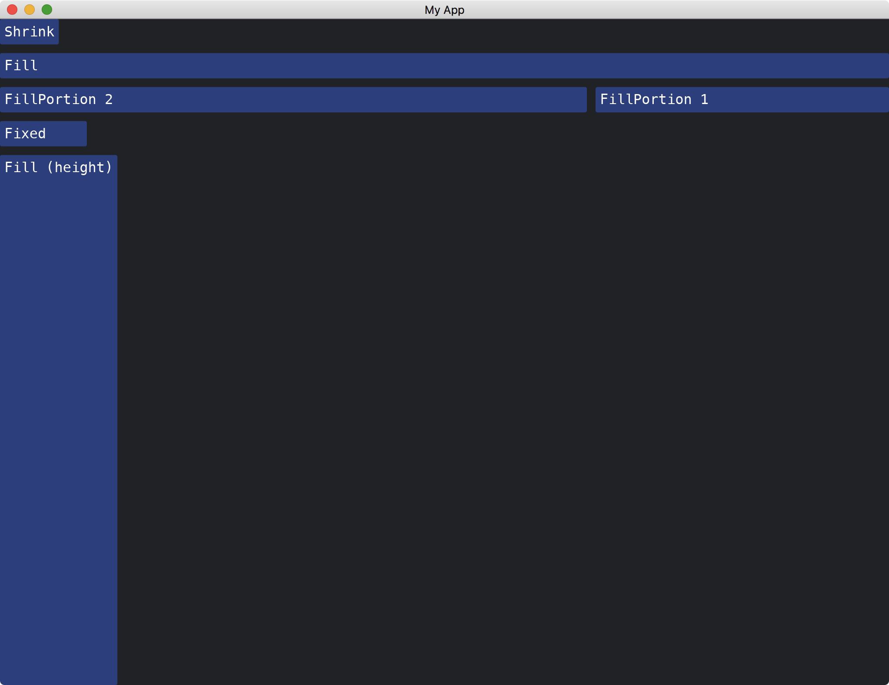

# Width And Height

Most widgets have the `width` and `height` methods to control their sizes.
The methods accept a parameter [Length](https://docs.rs/iced/latest/iced/enum.Length.html).
There are four types of [Length](https://docs.rs/iced/latest/iced/enum.Length.html):

* [Shrink](https://docs.rs/iced/latest/iced/enum.Length.html#variant.Shrink): occupy the least space.
* [Fill](https://docs.rs/iced/latest/iced/enum.Length.html#variant.Fill): occupy all the rest of space.
* [FillPortion](https://docs.rs/iced/latest/iced/enum.Length.html#variant.FillPortion): occupy the space relative to other widgets with [FillPortion](https://docs.rs/iced/latest/iced/enum.Length.html#variant.FillPortion).
* [Fixed](https://docs.rs/iced/latest/iced/enum.Length.html#variant.Fixed): occupy a fixed space.

```rust
use iced::{
    widget::{button, column, row},
    Length, Sandbox, Settings,
};

fn main() -> iced::Result {
    MyApp::run(Settings::default())
}

struct MyApp;

impl Sandbox for MyApp {
    type Message = ();

    fn new() -> Self {
        Self
    }

    fn title(&self) -> String {
        String::from("My App")
    }

    fn update(&mut self, _message: Self::Message) {}

    fn view(&self) -> iced::Element<'_, Self::Message> {
        column![
            button("Shrink").width(Length::Shrink),
            button("Fill").width(Length::Fill),
            row![
                button("FillPortion 2").width(Length::FillPortion(2)),
                button("FillPortion 1").width(Length::FillPortion(1)),
            ]
            .spacing(10),
            button("Fixed").width(Length::Fixed(100.)),
            button("Fill (height)").height(Length::Fill),
        ]
        .spacing(10)
        .into()
    }
}
```



:arrow_right:  Next: [Changing Themes](./changing_themes.md)

:blue_book: Back: [Table of contents](./../README.md)
